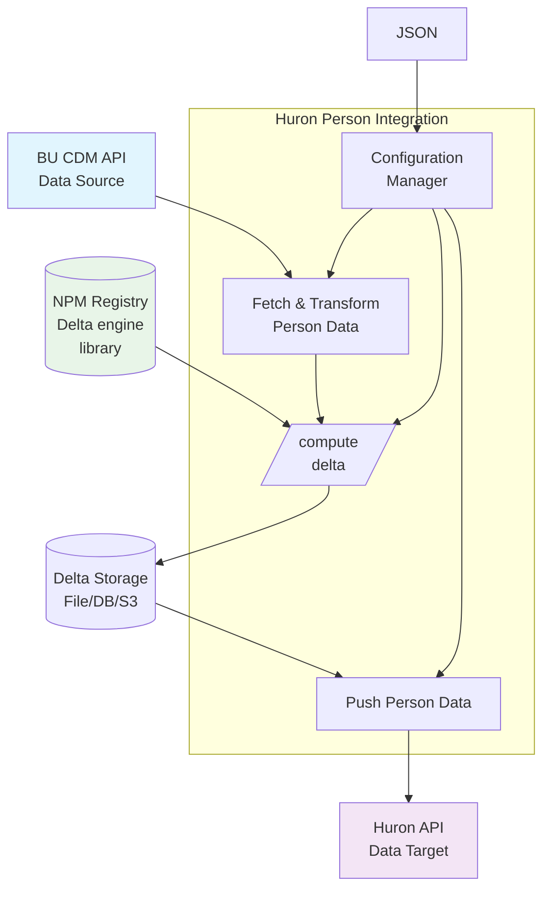

# Huron Person Integration

A TypeScript project that integrates person data from Huron API using the integration-core package.

## Overview

The Huron Person Integration is a data synchronization service that bridges Boston University's CDM (Common Data Model) system with the Huron research administration platform. It efficiently transfers person data using delta-based processing to minimize API calls and ensure data consistency across systems.

This solution is designed to run periodically (typically scheduled daily) to maintain up-to-date person information between systems. It supports multiple storage backends for delta tracking and provides comprehensive error handling and monitoring capabilities.



## Features

- **Dual Authentication**: 
  - **API Key Authentication** for DataSource (simple x-api-key header)
  - **JWT Authentication** for DataTarget (base64 encoded credentials with automatic token refresh)
- **Delta Processing**: Uses integration-core's EndToEnd class for efficient delta-based data synchronization
- **Flexible Storage**: Supports file, database, and S3 storage backends for delta data
- **Batch Processing**: Configurable batch sizes for API operations
- **Error Handling**: Comprehensive error handling and logging

## Project Architecture

### Source Structure
```
src/
├── ApiClientForJWT.ts        # JWT authentication client for DataTarget with token management
├── ApiClientForApiKey.ts     # API key authentication client for DataSource
├── IApiClient.ts             # Common interface for both authentication clients
├── Config.ts                 # TypeScript interfaces with nested endpointConfig structure
├── ConfigManager.ts          # Singleton configuration manager with validation and env overrides  
├── DeltaStrategyFactory.ts   # Factory for creating storage-appropriate delta strategies
├── PersonDataSource.ts       # BuCdmPersonDataSource - fetches data using API key auth
├── PersonDataTarget.ts       # HuronPersonDataTarget - pushes data using JWT auth
└── index.ts                  # Main exports and HuronPersonIntegration orchestrator
```

### Test Structure (79 Tests)
```
test/
├── ApiClientForJWT.test.ts   # JWT authentication, token refresh, error handling (15 tests)
├── ApiClientForApiKey.test.ts # API key authentication and request handling (15 tests)
├── ConfigManager.test.ts     # Configuration loading, validation, env overrides (15 tests) 
├── DeltaStrategyFactory.test.ts # Strategy factory and configuration handling (8 tests)
├── PersonDataSource.test.ts  # Data fetching, transformation, validation (9 tests)
├── PersonDataTarget.test.ts  # Push operations, batch processing, error recovery (15 tests)
└── index.test.ts            # Integration exports, class instantiation (10 tests)
```

### Build Output
```
dist/
├── cjs/          # CommonJS build for Node.js compatibility
├── esm/          # ES Module build for modern applications  
└── types/        # TypeScript declarations for full type safety
```

## Configuration System

The configuration system provides configuration management with validation, environment overrides, and multiple storage backend support.

### Configuration File (`config.json`)

Complete configuration with all available options:

```json
{
  "dataSource": {
    "endpointConfig": {
      "baseUrl": "https://api-dev.bu.edu/huron",
      "apiKey": "your_api_key_here",
      "timeout": 30000
    },
    "fetchPersonsPath": "/cdm/persons"
  },
  "dataTarget": {
    "endpointConfig": {
      "baseUrl": "https://huron-target.bu.edu",
      "authTokenUrl": "https://huron-target.bu.edu/auth",
      "username": "huron_push_account", 
      "password": "target_password_here",
      "timeout": 60000
    },
    "personsPath": "/api/persons/batch"
  },
  "integration": {
    "clientId": "bu-huron-person-integration"
  },
  "storage": {
    "type": "file",
    "config": {
      "path": "./data/delta-storage"
    }
  }
}
```

### Environment Variable Overrides

The ConfigManager supports environment variable overrides for secure credential management:

```bash
# Data Source Overrides (API Key Authentication)
export DATASOURCE_ENDPOINTCONFIG_BASE_URL="https://prod-budev-fm.snaplogic.io"
export DATASOURCE_ENDPOINTCONFIG_API_KEY="prod_api_key_here"
export DATASOURCE_ENDPOINT_PERSON_PATH="/api/1/rest/feed-master/queue/BUDev/Admin-Integration-Services/CommonServiceWrappers/huronIRBPerson"

# Data Target Overrides (JWT Authentication)
export DATATARGET_ENDPOINTCONFIG_BASE_URL="https://bu.hrs-staging.com"
export DATATARGET_ENDPOINTCONFIG_LOGIN_SVC_PATH="/loginsvc/api/v1/token/"
export DATATARGET_ENDPOINTCONFIG_USER_ID="prod_user_id"
export DATATARGET_ENDPOINTCONFIG_EXTERNAL_TOKEN="prod_external_token"

# Integration Overrides
export CLIENT_ID="prod-bu-huron-integration"
```

### Configuration Validation

The system automatically validates all required fields:
- Data source/target URLs and credentials
- Storage configuration based on type
- Endpoint paths and timeout values
- Batch size and processing parameters

## Installation & Setup

### For Development (Working on this Project)

```bash
# Clone the repository
git clone <huron-person-repo>
cd integration-huron-person

# Install dependencies (including integration-core)
npm install

# Run tests to verify setup
npm test
```

### For Production Use (Installing as a Dependency)

If you want to use this integration package in another project:

```bash
# First, build the package from this repository
cd integration-huron-person
npm run pack  # Creates integration-huron-person-1.0.0.tgz

# Then in your consuming project, install the package
# integration-core will be installed automatically as a dependency
npm install ./path/to/integration-huron-person-1.0.0.tgz

# Verify installation
npm list integration-core
npm list integration-huron-person
```

### Dependencies & Architecture

This project uses a modular architecture with proper TypeScript integration:

**Runtime Dependencies:**
- `integration-core@1.0.0` - Core delta processing framework
- `axios@^1.7.7` - HTTP client for API communication
- `fs` and `path` - File system operations (Node.js built-ins)

**Development Dependencies:**
- `typescript@^5.6.3` - TypeScript compiler with strict type checking
- `jest@^29.7.0` + `ts-jest@^29.2.5` - Testing framework with TypeScript support  
- `@types/*` packages - Type definitions for all dependencies
- `esbuild@^0.24.0` - Fast JavaScript bundler

**Integration-Core Type Resolution:**
The project includes proper TypeScript declaration resolution for integration-core exports, ensuring full IntelliSense and type safety.

## Usage

### Basic Usage

```typescript
import { HuronPersonIntegration, ConfigManager } from 'integration-huron-person';

// Load and validate configuration using chaining API
const configManager = ConfigManager.getInstance();
const config = configManager.reset().fromFileSystem('./config.json').fromEnvironment().getConfig();

// Create and run integration
const integration = new HuronPersonIntegration(config);
const result = await integration.run();

console.log(`Integration completed with status: ${result.status}`);
```

### Advanced Usage with Custom Components

```typescript
import {
  HuronApiClientForJWT,
  HuronApiClientForApiKey,
  BuCdmPersonDataSource, 
  HuronPersonDataTarget,
  HuronDeltaStrategyFactory
} from 'integration-huron-person';

import { EndToEnd } from 'integration-core';

// Create components manually with appropriate authentication
const dataSource = new BuCdmPersonDataSource(config);
const dataTarget = new HuronPersonDataTarget(config);

// Create delta strategy based on configuration
const strategyFactory = new HuronDeltaStrategyFactory();
const deltaStrategy = strategyFactory.createStrategy(config);

// Run integration with custom components
const endToEnd = new EndToEnd(dataSource, dataTarget, deltaStrategy);
const result = await endToEnd.run();
```

### Development Commands

```bash
# Run development build with watch mode
npm run dev

# Run comprehensive test suite (79 tests)
npm test

# Run specific test file
npm test -- test/PersonDataTarget.test.ts

# Build for production (dual ESM/CJS)
npm run build

# Create distribution package
npm run pack
```

### Production Deployment

```bash
# Build optimized production bundle
npm run build

# Run the integration
node dist/cjs/index.js

# Or use the entry point directly
npm start
```

## Storage Options

### File Storage
```json
{
  "storage": {
    "type": "file",
    "config": {
      "path": "./data/delta-storage"
    }
  }
}
```

### Database Storage
```json
{
  "storage": {
    "type": "database",
    "config": {
      "type": "postgresql",
      "host": "localhost",
      "port": 5432,
      "username": "user",
      "password": "password",
      "database": "huron_integration"
    }
  }
}
```

### S3 Storage
```json
{
  "storage": {
    "type": "s3",
    "config": {
      "bucketName": "huron-integration-data",
      "keyPrefix": "person-data/",
      "region": "us-east-1"
    }
  }
}
```

## Integration Workflow

### Complete Integration Flow

The system implements a sophisticated delta-based synchronization workflow:

1. **Configuration Loading & Validation**
   - Load configuration from file with comprehensive validation
   - Apply environment variable overrides for secure credential management
   - Validate all required fields and storage configuration

2. **Authentication & API Setup** 
   - Establish secure connections to both source and target APIs
   - Handle JWT token acquisition and automatic refresh
   - Configure request interceptors for authentication headers

3. **Data Source Processing**
   - Fetch raw person data from BU CDM API
   - Transform and validate data using field definitions
   - Generate cryptographic hashes for change detection

4. **Delta Computation**
   - Compare current data against stored baseline using integration-core
   - Identify added, updated, and removed records efficiently  
   - Use selected storage backend (file/database/S3) for baseline management

5. **Intelligent Batch Processing**
   - Process changes in configurable batch sizes for optimal performance
   - Handle partial failures with detailed error tracking
   - Implement retry logic and failure recovery mechanisms

6. **Target System Updates**
   - Push only delta changes to Huron target system
   - Support CREATE, UPDATE, and DELETE operations
   - Provide detailed success/failure reporting per operation

7. **Baseline Management & Recovery**
   - Update stored baseline data after successful processing
   - Restore previous hashes for failed operations to ensure proper change detection
   - Maintain data consistency across integration runs

### Error Handling & Recovery

- **API Failures**: Automatic retry with exponential backoff
- **Batch Processing**: Partial failure handling with individual record tracking
- **Data Validation**: Comprehensive field validation with detailed error messages  
- **Hash Restoration**: Automatic rollback of hashes for failed operations
- **Configuration Issues**: Clear error messages for misconfiguration

## Testing & Quality Assurance

### Comprehensive Test Suite (60+ Tests)

The project includes extensive testing coverage across all components:

**Test Categories:**
- **Unit Tests**: Individual component testing with detailed mocking
- **Integration Tests**: End-to-end workflow validation  
- **Configuration Tests**: Validation, loading, and environment override testing
- **API Tests**: HTTP client, authentication, and error handling
- **Data Processing Tests**: Transformation, validation, and batch processing

**Test Highlights:**
- **MockApiClient**: Sophisticated API mocking with sequential response handling
- **Configuration Validation**: Complete coverage of all configuration scenarios
- **Batch Processing**: Complex batch operation testing with failure simulation  
- **Error Recovery**: Hash restoration and failure handling validation
- **Type Safety**: Full TypeScript integration testing with integration-core

### Running Tests

```bash
# Run all tests (60+ tests)
npm test

# Run with verbose output for detailed results  
npm test -- --verbose

# Run specific test suites
npm test -- test/PersonDataTarget.test.ts    # Batch processing tests
npm test -- test/ConfigManager.test.ts       # Configuration tests  
npm test -- test/ApiClient.test.ts          # HTTP client tests

# Run tests with coverage reporting
npm test -- --coverage
```

### Quality Metrics

- **Test Coverage**: Comprehensive coverage across all major components
- **Type Safety**: 100% TypeScript with strict type checking enabled
- **Error Handling**: All failure scenarios tested and validated
- **Integration**: Full integration-core compatibility verified

## Extending & Customization

### Data Source Customization

Extend `BuCdmPersonDataSource` for different data sources:

```typescript
class CustomPersonDataSource extends BuCdmPersonDataSource {
  async fetchRaw(): Promise<any[]> {
    // Custom data fetching logic
    return await this.customApiCall();
  }

  convertRawToInput(rawData: any[]): Input {
    // Custom data transformation
    return {
      fieldDefinitions: this.getCustomFieldDefinitions(),
      fieldSets: rawData.map(item => this.transformCustomItem(item))
    };
  }
}
```

### Data Target Customization

Extend `HuronPersonDataTarget` for different target systems:

```typescript  
class CustomPersonDataTarget extends HuronPersonDataTarget {
  convertFieldSetToRequest(fieldSet: FieldSet): any {
    // Custom request format transformation
    return {
      customField: fieldSet.fieldValues.find(f => f.name === 'id')?.value,
      // ... other transformations
    };
  }
}
```

### Authentication Extensions

Extend the existing API clients for different authentication methods:

```typescript
class CustomApiClient extends HuronApiClient {
  protected async authenticate(): Promise<string> {
    // Custom authentication logic (OAuth, API keys, etc.)
    return await this.customAuthFlow();
  }
}
```

### Configuration Extensions

Add custom configuration fields:

```typescript
interface CustomConfig extends Config {
  customSection: {
    customField: string;
    customOptions: string[];
  };
}
```

## Production Considerations

### Performance Optimization
- **Batch Size Tuning**: Optimize `batchSize` based on API performance and memory constraints
- **Timeout Configuration**: Adjust timeouts based on network conditions and data volumes
- **Storage Selection**: Choose appropriate storage backend (file/database/S3) based on scale

### Security Best Practices
- **Environment Variables**: Use env vars for all sensitive credentials in production
- **Token Management**: JWT tokens are automatically refreshed and secured
- **Configuration Validation**: All inputs are validated before processing

### Monitoring & Logging
- **Detailed Logging**: Comprehensive logging of all operations and errors
- **Status Reporting**: Clear success/failure reporting with detailed metrics
- **Error Tracking**: Individual record-level error tracking for debugging

### Scalability
- **Delta Processing**: Only changed records are processed, enabling efficient large-scale operations
- **Storage Backends**: Database and S3 options support enterprise-scale data volumes
- **Batch Processing**: Configurable batching prevents memory issues with large datasets