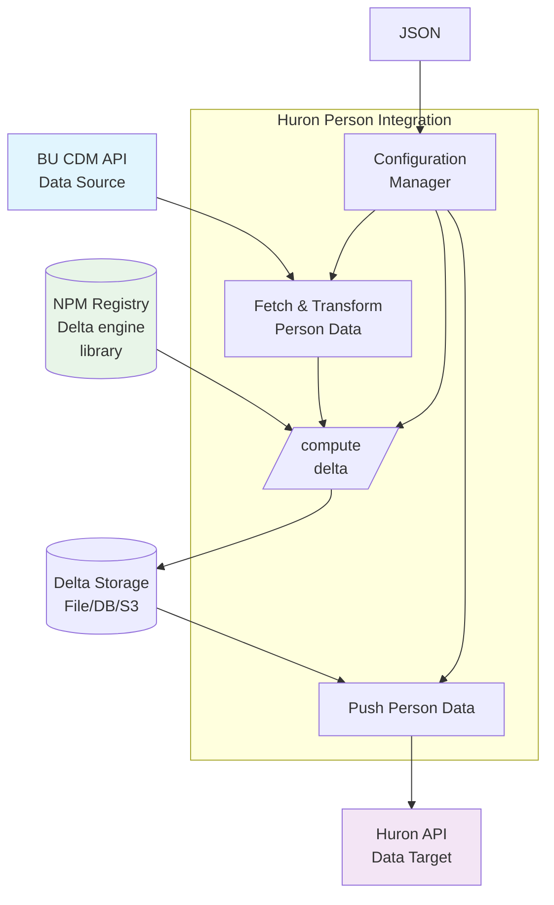

# Huron Person Integration

A TypeScript project that integrates person data from Huron API using the integration-core package.

## Repository Boundaries

This project is an independently versioned npm package with its own Git repository.

It depends on `integration-core` as a package dependency. The workspace groups related repositories for development convenience, but each project remains a separate source-control and release unit.

## Shared Copilot Skills Setup (VS Code Configuration)

*NOTE: The following assumes a VS Code development environment - adapt as needed for other editors.*

Shared skills are maintained in a separate repository at `integration-workspace-skills/` and discovered by VS Code's Copilot using the `chat.agentSkillsLocations` setting.

Add this setting to your [**`.code-workspace`** file](https://code.visualstudio.com/docs/editing/workspaces/workspaces#_workspace-settings) to enable skill discovery. **Important**: In [**multi-root**](https://code.visualstudio.com/docs/editing/workspaces/workspaces#_multiroot-workspaces) `.code-workspace` configurations, paths in `chat.agentSkillsLocations` are resolved relative to each workspace root folder.

Use this canonical settings entry:

```json
"chat.agentSkillsLocations": {
  "../integration-workspace-skills/skills": true
}
```

### Scenario 1: Working only on integration-core

```json
{
  "folders": [
    {
      "path": "integration-workspace-skills",
      "name": "skills"
    },
    {
      "path": "integration-core",
      "name": "core"
    }
  ],
  "settings": {
    "chat.tools.terminal.autoApprove": {
      "npm test": true
    },
    "chat.agentSkillsLocations": {
      "../integration-workspace-skills/skills": true
    }
  }
}
```

### Scenario 2: Working on core + person + fargate

```json
{
  "folders": [
    {
      "path": "integration-workspace-skills",
      "name": "skills"
    },
    {
      "path": "integration-core",
      "name": "core"
    },
    {
      "path": "integration-huron-person",
      "name": "huron-person"
    },
    {
      "path": "integration-huron-person-fargate",
      "name": "huron-person-fargate"
    }
  ],
  "settings": {
    "chat.tools.terminal.autoApprove": {
      "npm test": true
    },
    "chat.agentSkillsLocations": {
      "../integration-workspace-skills/skills": true
    }
  }
}
```

## Overview

The Huron Person Integration is a data synchronization service that bridges Boston University's CDM (Common Data Model) system with the Huron research administration platform. It efficiently transfers person data using delta-based processing to minimize API calls and ensure data consistency across systems.

This solution is designed to run periodically (typically scheduled daily) to maintain up-to-date person information between systems. It supports multiple storage backends for delta tracking and provides comprehensive error handling and monitoring capabilities.


```mermaid
graph TD
    J[JSON] --> G[Configuration<br/>Manager]
    A[BU CDM API<br/>Data Source] --> B[Fetch & Transform<br/>Person Data]
    C[(NPM Registry<br/>Delta engine<br/>library)] --> H[/compute<br/>delta/]
    B --> H
    H --> D[(Delta Storage<br/>File/DB/S3)]
    D --> F[Push Person Data]
    F --> E[Huron API<br/>Data Target]
    
    subgraph "Huron Person Integration"
        G
        B
        H
        F
    end
    
    G --> B
    G --> F
    G --> H
    
    style A fill:#e1f5fe
    style E fill:#f3e5f5
    style C fill:#e8f5e8
```

## Features

- **Dual Authentication**: 
  - **API Key Authentication** for DataSource (simple x-api-key header)
  - **JWT Authentication** for DataTarget (base64 encoded credentials with automatic token refresh)
- **Delta Processing**: Uses integration-core's EndToEnd class for efficient delta-based data synchronization
- **Flexible Storage**: Supports file, database, and S3 storage backends for delta data
- **Batch Processing**: Configurable batch sizes for API operations
- **Dry Run Mode**: Test synchronization logic without modifying target system or delta storage
- **Error Handling**: Comprehensive error handling and logging

## Project Architecture

### Source Structure
```
src/
├── ApiClientForJWT.ts        # JWT authentication client for DataTarget with token management
├── ApiClientForApiKey.ts     # API key authentication client for DataSource
├── IApiClient.ts             # Common interface for both authentication clients
├── Config.ts                 # TypeScript interfaces with nested endpointConfig structure
├── ConfigManager.ts          # Singleton configuration manager with validation and env overrides  
├── ConfigValidator.ts        # Configuration validation with execution mode support
├── DeltaStrategyFactory.ts   # Factory for creating storage-appropriate delta strategies
├── data-source/
│   ├── DataSource.ts         # BuCdmDataSource - abstract base class for CDM data sources
│   ├── PersonDataSource.ts   # BuCdmPersonDataSource - fetches single person data using API key auth
│   └── PeopleDataSource.ts   # BuCdmPeopleDataSource - fetches bulk people data using API key auth
├── data-target/
│   ├── crud/
│   │   ├── ReadOrganizations.ts # Read organization data from Huron API
│   │   ├── ReadPeople.ts       # Read people data from Huron API
│   │   ├── ReadPerson.ts       # Read single person data from Huron API
│   │   └── ReadOrganization.ts # Read single organization data from Huron API
│   ├── ApiClientForJWT.ts      # JWT authentication client for DataTarget
│   ├── AuthToken.ts            # Authentication token management
│   └── QueryBuilder.ts         # Query building utilities
├── PersonDataTarget.ts       # HuronPersonDataTarget - pushes data using JWT auth
├── SyncPeople.ts             # Bulk people synchronization orchestrator
├── SyncPerson.ts             # Single person synchronization orchestrator
└── index.ts                  # Main exports and integration orchestrators
```

### Test Structure (79 Tests)
```
test/
├── ApiClientForJWT.test.ts   # JWT authentication, token refresh, error handling (15 tests)
├── ApiClientForApiKey.test.ts # API key authentication and request handling (15 tests)
├── ConfigManager.test.ts     # Configuration loading, validation, env overrides (15 tests) 
├── DeltaStrategyFactory.test.ts # Strategy factory and configuration handling (8 tests)
├── PersonDataSource.test.ts  # Data fetching, transformation, validation (9 tests)
├── PersonDataTarget.test.ts  # Push operations, batch processing, error recovery (15 tests)
└── index.test.ts            # Integration exports, class instantiation (10 tests)
```

### Build Output
```
dist/
├── cjs/          # CommonJS build for Node.js compatibility
├── esm/          # ES Module build for modern applications  
└── types/        # TypeScript declarations for full type safety
```

## Configuration System

The configuration system provides configuration management with validation, environment overrides, and multiple storage backend support.

### Configuration File (`config.json`)

Complete configuration with all available options:

```json
{
  "dataSource": {
    "person": {
      "endpointConfig": {
        "baseUrl": "https://prod-butest-fm.snaplogic.io",
        "apiKey": "your_person_api_key_here",
        "timeout": 300000
      },
      "fetchPath": "/api/1/rest/feed-master/queue/BUTest/Admin-Integration-Services/CommonServiceWrappers/huronIRBPerson",
      "fieldsOfInterest": [
        "personid",
        "personBasic.names[*].firstName",
        "personBasic.names[*].lastName",
        "personBasic.names[*].middleName"
      ]
    },
    "people": {
      "endpointConfig": {
        "baseUrl": "https://prod-butest-fm.snaplogic.io",
        "apiKey": "your_people_api_key_here",
        "timeout": 600000
      },
      "fetchPath": "/api/1/rest/feed/run/task/BUTest/Admin-Integration-Services/GenericGets/huronIRBgetPersonByPopulation",
      "fieldsOfInterest": [
        "personid",
        "personBasic.names[*].firstName",
        "personBasic.names[*].lastName",
        "personBasic.names[*].middleName"
      ]
    }
  },
  "dataTarget": {
    "endpointConfig": {
      "baseUrl": "https://bu.hrs-staging.com",
      "authMethod": "externalToken",
      "externalToken": "your-external-token-here",
      "userId": "bu-sso_wrh@bu.edu",
      "loginSvcPath": "/loginsvc/api/v1/token/",
      "timeout": 30000
    },
    "personsPath": "/api/v2/persons",
    "organizationsPath": "/api/v2/organizations"
  },
  "integration": {
    "clientId": "huron-person-integration",
    "batchSize": 100,
    "timeout": 30000
  },
  "storage": {
    "type": "file",
    "config": {
      "path": "./data/delta-storage"
    }
  }
}
```

### Environment Variable Overrides

The ConfigManager supports environment variable overrides for secure credential management:

```bash
# Data Source Overrides (API Key Authentication) - Person Mode
export DATASOURCE_ENDPOINTCONFIG_PERSON_BASE_URL="https://prod-butest-fm.snaplogic.io"
export DATASOURCE_ENDPOINTCONFIG_PERSON_API_KEY="prod_person_api_key_here"
export DATASOURCE_ENDPOINTCONFIG_PERSON_PATH="/api/1/rest/feed-master/queue/BUTest/Admin-Integration-Services/CommonServiceWrappers/huronIRBPerson"

# Data Source Overrides (API Key Authentication) - People Mode
export DATASOURCE_ENDPOINTCONFIG_PEOPLE_BASE_URL="https://prod-butest-fm.snaplogic.io"
export DATASOURCE_ENDPOINTCONFIG_PEOPLE_API_KEY="prod_people_api_key_here"
export DATASOURCE_ENDPOINTCONFIG_PEOPLE_PATH="/api/1/rest/feed/run/task/BUTest/Admin-Integration-Services/GenericGets/huronIRBgetPersonByPopulation"

# Data Target Overrides (JWT Authentication)
export DATATARGET_ENDPOINTCONFIG_BASE_URL="https://bu.hrs-staging.com"
export DATATARGET_ENDPOINTCONFIG_LOGIN_SVC_PATH="/loginsvc/api/v1/token/"
export DATATARGET_ENDPOINTCONFIG_USER_ID="bu-sso_wrh@bu.edu"
export DATATARGET_ENDPOINTCONFIG_EXTERNAL_TOKEN="prod_external_token"

# Integration Overrides
export CLIENT_ID="prod-bu-huron-integration"
export BATCH_SIZE="100"
export TIMEOUT="30000"
```

### Configuration Validation

The system automatically validates all required fields based on the execution mode:
- **Person mode**: Validates `dataSource.person` configuration for single-person operations
- **People mode**: Validates `dataSource.people` configuration for bulk-people operations  
- **None mode**: No data source validation required for data-target-only operations
- Data target configuration is always validated regardless of mode
- Storage configuration based on type
- Endpoint paths and timeout values
- Batch size and processing parameters

### Dry Run Mode

Dry run mode allows you to test the synchronization logic without making any changes to the target system or delta storage. This is useful for:
- **Testing**: Validate configuration and data mapping without affecting production data
- **Debugging**: See what operations would be performed without executing them
- **Auditing**: Review synchronization plans before actual execution

#### Enabling Dry Run

**Option 1: Configuration File**
```json
{
  "dataTarget": {
    "endpointConfig": { ... },
    "personsPath": "/api/v2/persons",
    "organizationsPath": "/api/v2/organizations",
    "dryRun": true
  }
}
```

**Option 2: Environment Variable**
```bash
export DRY_RUN=true
node dist/index.js
```

#### Dry Run Behavior

When dry run mode is enabled:

✅ **Still Performed (Read-Only Operations)**:
- Data fetching from source systems (API/S3)
- Data mapping and transformation
- Delta computation
- Reading from target system (e.g., HRN lookups)
- Reading previous delta data from storage

❌ **Skipped (Write Operations)**:
- POST/PATCH/DELETE operations to target API
- Updates to delta storage (`updatePreviousData`)
- Any modifications to target system

**Console Output**:
```
[DRY RUN] Would perform CREATE operation on endpoint /api/v2/persons with data: {...}
[DRY RUN] - updatePreviousData: {"clientId":"...","newPreviousData":[...]}
```

**Results**:
- All operations return `Status.SUCCESS` with mock data (`hrn: 'dryrun'`)
- Logs show what would have been executed
- No actual changes are made to any system

### Execution Modes

The integration supports three execution modes to handle different operational scenarios:

#### Person Mode (`'person'`)
Used for single-person synchronization operations:
- Validates `dataSource.person` configuration
- Uses `BuCdmPersonDataSource` for data fetching
- Suitable for individual person updates and lookups

#### People Mode (`'people'`)
Used for bulk-people synchronization operations:
- Validates `dataSource.people` configuration  
- Uses `BuCdmPeopleDataSource` for data fetching
- Suitable for population-wide data synchronization

#### None Mode (`'none'`)
Used for data-target-only operations:
- No data source validation required
- Suitable for reading data from Huron API without source synchronization
- Used by `ReadPerson`, `ReadPeople`, `ReadOrganization`, and `ReadOrganizations` classes

## Test Harnesses

Test harnesses are executable modules that verify individual components using environment-based configuration via the `TestEnvironment` utility from `integration-core`. Each harness loads its own prefixed environment variables and validates component behavior in isolation.

Harness configuration is documented in [example-env.md](./example-env.md). The file contains grouped environment variables for 30 test harnesses covering:
- **Configuration Management**: `ConfigFromSecretsManager`, `ConfigManager`
- **Data Mapping**: `DataMapper` (base, country, org, state), `FieldFilter`, `MappingValidator`
- **Data Sources**: `CurrentTermsDataSource`, `PeopleCdmDataSource`, `PeopleDataSourceBatch`, `PeopleS3DataSource`, `PersonDataSource`
- **Data Targets**: `AuthToken`, `DeactivatePerson`, `ListPeople`, `OrganizationDataTarget`, `ReadList`, `ReadOrganization`, `ReadOrganizations`, `ReadPeople`, `ReadPerson`
- **Delta Strategy**: `UpsertDeltaStrategy`
- **Miscellaneous**: `BulkTargetPatcher`, `BulkTargetPatcherForSourceIdentifier`, `ChunkScanner`, `SyncEvaluator`
- **Main Orchestrators**: `SyncPeople`, `SyncPerson`, `SyncPersonBatch`

### Running Test Harnesses

**Option 1: Using VS Code Launch Configuration (Recommended)**

1. Open the harness file in the editor (e.g., `src/data-mapper/DataMapper.ts`)
2. Press `F5` or go to **Run > Start Debugging**
3. Select "Debug current file" from the launch configuration dropdown
4. The harness will execute with your `.env` file automatically loaded

**Option 2: Command Line with npx**

```bash
# Example: Run the DataMapper harness
npx ts-node src/data-mapper/DataMapper.ts

# Example: Run the ReadPerson harness
npx ts-node src/data-target/crud/ReadPerson.ts

# Example: Run the SyncPeople harness
npx ts-node src/SyncPeople.ts
```

## Installation & Setup

### For Development (Working on this Project)

```bash
# Clone the repository
git clone <huron-person-repo>
cd integration-huron-person

# Install dependencies (including integration-core)
npm install

# Run tests to verify setup
npm test
```

### For Production Use (Installing as a Dependency)

If you want to use this integration package in another project:

```bash
# First, build the package from this repository
cd integration-huron-person
npm run pack  # Creates integration-huron-person-1.0.0.tgz

# Then in your consuming project, install the package
# integration-core will be installed automatically as a dependency
npm install ./path/to/integration-huron-person-1.0.0.tgz

# Verify installation
npm list integration-core
npm list integration-huron-person
```

### Dependencies & Architecture

This project uses a modular architecture with proper TypeScript integration:

**Runtime Dependencies:**
- `integration-core@1.0.0` - Core delta processing framework
- `axios@^1.7.7` - HTTP client for API communication
- `fs` and `path` - File system operations (Node.js built-ins)

**Development Dependencies:**
- `typescript@^5.6.3` - TypeScript compiler with strict type checking
- `jest@^29.7.0` + `ts-jest@^29.2.5` - Testing framework with TypeScript support  
- `@types/*` packages - Type definitions for all dependencies
- `esbuild@^0.24.0` - Fast JavaScript bundler

**Integration-Core Type Resolution:**
The project includes proper TypeScript declaration resolution for integration-core exports, ensuring full IntelliSense and type safety.

## Usage

### Basic Usage

```typescript
import { HuronPersonIntegration, ConfigManager } from 'integration-huron-person';

// Load and validate configuration using chaining API
const configManager = ConfigManager.getInstance();
const config = configManager.reset().fromEnvironment().fromFileSystem().getConfig('people');

// Create and run bulk people integration
const integration = new HuronPersonIntegration(config);
const result = await integration.run();

console.log(`Integration completed with status: ${result.status}`);
```

### Execution Mode Usage

```typescript
import { SyncPerson, SyncPeople, ConfigManager } from 'integration-huron-person';

const configManager = ConfigManager.getInstance();

// Single person synchronization
const personConfig = configManager.reset().fromEnvironment().fromFileSystem().getConfig('person');
const personSync = new SyncPerson({ config: personConfig, buid: 'U123456' });
await personSync.run();

// Bulk people synchronization  
const peopleConfig = configManager.reset().fromEnvironment().fromFileSystem().getConfig('people');
const peopleSync = new SyncPeople({ config: peopleConfig });
await peopleSync.run();

// Data-target-only operations (no data source validation)
const targetOnlyConfig = configManager.reset().fromEnvironment().fromFileSystem().getConfig('none');
// Use ReadPerson, ReadPeople, ReadOrganization, ReadOrganizations classes
```

### Advanced Usage with Custom Components

```typescript
import {
  HuronApiClientForJWT,
  HuronApiClientForApiKey,
  BuCdmPersonDataSource,
  BuCdmPeopleDataSource,
  HuronPersonDataTarget,
  HuronDeltaStrategyFactory
} from 'integration-huron-person';

import { EndToEnd } from 'integration-core';

// Create components manually with appropriate authentication
const dataSource = new BuCdmPeopleDataSource({ config }); // or BuCdmPersonDataSource
const dataTarget = new HuronPersonDataTarget(config);

// Create delta strategy based on configuration
const strategyFactory = new HuronDeltaStrategyFactory();
const deltaStrategy = strategyFactory.createStrategy(config);

// Run integration with custom components
const endToEnd = new EndToEnd(dataSource, dataTarget, deltaStrategy);
const result = await endToEnd.run();
```

### Development Commands

```bash
# Run development build with watch mode
npm run dev

# Run comprehensive test suite (79 tests)
npm test

# Run specific test file
npm test -- test/PersonDataTarget.test.ts

# Build for production (dual ESM/CJS)
npm run build

# Create distribution package
npm run pack
```

### Production Deployment

```bash
# Build optimized production bundle
npm run build

# Run the integration
node dist/cjs/index.js

# Or use the entry point directly
npm start
```

## Storage Options

### File Storage
```json
{
  "storage": {
    "type": "file",
    "config": {
      "path": "./data/delta-storage"
    }
  }
}
```

### Database Storage
```json
{
  "storage": {
    "type": "database",
    "config": {
      "type": "postgresql",
      "host": "localhost",
      "port": 5432,
      "username": "user",
      "password": "password",
      "database": "huron_integration"
    }
  }
}
```

### S3 Storage
```json
{
  "storage": {
    "type": "s3",
    "config": {
      "bucketName": "huron-integration-data",
      "keyPrefix": "person-data/",
      "region": "us-east-1"
    }
  }
}
```

## Integration Workflow

### Complete Integration Flow

The system implements a sophisticated delta-based synchronization workflow:

1. **Configuration Loading & Validation**
   - Load configuration from file with comprehensive validation
   - Apply environment variable overrides for secure credential management
   - Validate all required fields and storage configuration

2. **Authentication & API Setup** 
   - Establish secure connections to both source and target APIs
   - Handle JWT token acquisition and automatic refresh
   - Configure request interceptors for authentication headers

3. **Data Source Processing**
   - Fetch raw person data from BU CDM API
   - Transform and validate data using field definitions
   - Generate cryptographic hashes for change detection

4. **Delta Computation**
   - Compare current data against stored baseline using integration-core
   - Identify added, updated, and removed records efficiently  
   - Use selected storage backend (file/database/S3) for baseline management

5. **Intelligent Batch Processing**
   - Process changes in configurable batch sizes for optimal performance
   - Handle partial failures with detailed error tracking
   - Implement retry logic and failure recovery mechanisms

6. **Target System Updates**
   - Push only delta changes to Huron target system
   - Support CREATE, UPDATE, and DELETE operations
   - Provide detailed success/failure reporting per operation

7. **Baseline Management & Recovery**
   - Update stored baseline data after successful processing
   - Restore previous hashes for failed operations to ensure proper change detection
   - Maintain data consistency across integration runs

### Error Handling & Recovery

- **API Failures**: Automatic retry with exponential backoff
- **Batch Processing**: Partial failure handling with individual record tracking
- **Data Validation**: Comprehensive field validation with detailed error messages  
- **Hash Restoration**: Automatic rollback of hashes for failed operations
- **Configuration Issues**: Clear error messages for misconfiguration

## Testing & Quality Assurance

### Comprehensive Test Suite (60+ Tests)

The project includes extensive testing coverage across all components:

**Test Categories:**
- **Unit Tests**: Individual component testing with detailed mocking
- **Integration Tests**: End-to-end workflow validation  
- **Configuration Tests**: Validation, loading, and environment override testing
- **API Tests**: HTTP client, authentication, and error handling
- **Data Processing Tests**: Transformation, validation, and batch processing

**Test Highlights:**
- **MockApiClient**: Sophisticated API mocking with sequential response handling
- **Configuration Validation**: Complete coverage of all configuration scenarios
- **Batch Processing**: Complex batch operation testing with failure simulation  
- **Error Recovery**: Hash restoration and failure handling validation
- **Type Safety**: Full TypeScript integration testing with integration-core

### Running Tests

```bash
# Run all tests (60+ tests)
npm test

# Run with verbose output for detailed results  
npm test -- --verbose

# Run specific test suites
npm test -- test/PersonDataTarget.test.ts    # Batch processing tests
npm test -- test/ConfigManager.test.ts       # Configuration tests  
npm test -- test/ApiClient.test.ts          # HTTP client tests

# Run tests with coverage reporting
npm test -- --coverage
```

### Quality Metrics

- **Test Coverage**: Comprehensive coverage across all major components
- **Type Safety**: 100% TypeScript with strict type checking enabled
- **Error Handling**: All failure scenarios tested and validated
- **Integration**: Full integration-core compatibility verified

## Extending & Customization

### Data Source Customization

Extend `BuCdmDataSource` for different data sources:

```typescript
class CustomPersonDataSource extends BuCdmDataSource {
  public readonly name = 'Custom Person Data Source';
  public readonly description = 'Fetches person data from custom API endpoint';

  protected getEndpointConfig(): EndpointConfigForApiKey {
    // Return person-specific endpoint config
    return this.config.dataSource.person!.endpointConfig;
  }

  protected getFetchPath(): string {
    // Return person-specific fetch path
    return this.config.dataSource.person!.fetchPath;
  }
}

class CustomPeopleDataSource extends BuCdmDataSource {
  public readonly name = 'Custom People Data Source';
  public readonly description = 'Fetches bulk people data from custom API endpoint';

  protected getEndpointConfig(): EndpointConfigForApiKey {
    // Return people-specific endpoint config
    return this.config.dataSource.people!.endpointConfig;
  }

  protected getFetchPath(): string {
    // Return people-specific fetch path
    return this.config.dataSource.people!.fetchPath;
  }
}
```

### Data Target Customization

Extend `HuronPersonDataTarget` for different target systems:

```typescript  
class CustomPersonDataTarget extends HuronPersonDataTarget {
  convertFieldSetToRequest(fieldSet: FieldSet): any {
    // Custom request format transformation
    return {
      customField: fieldSet.fieldValues.find(f => f.name === 'id')?.value,
      // ... other transformations
    };
  }
}
```

### Authentication Extensions

Extend the existing API clients for different authentication methods:

```typescript
class CustomApiClient extends HuronApiClient {
  protected async authenticate(): Promise<string> {
    // Custom authentication logic (OAuth, API keys, etc.)
    return await this.customAuthFlow();
  }
}
```

### Configuration Extensions

Add custom configuration fields:

```typescript
interface CustomConfig extends Config {
  customSection: {
    customField: string;
    customOptions: string[];
  };
}
```

## Production Considerations

### Performance Optimization
- **Batch Size Tuning**: Optimize `batchSize` based on API performance and memory constraints
- **Timeout Configuration**: Adjust timeouts based on network conditions and data volumes
- **Storage Selection**: Choose appropriate storage backend (file/database/S3) based on scale

### Security Best Practices
- **Environment Variables**: Use env vars for all sensitive credentials in production
- **Token Management**: JWT tokens are automatically refreshed and secured
- **Configuration Validation**: All inputs are validated before processing

### Monitoring & Logging
- **Detailed Logging**: Comprehensive logging of all operations and errors
- **Status Reporting**: Clear success/failure reporting with detailed metrics
- **Error Tracking**: Individual record-level error tracking for debugging

### Scalability
- **Delta Processing**: Only changed records are processed, enabling efficient large-scale operations
- **Storage Backends**: Database and S3 options support enterprise-scale data volumes
- **Batch Processing**: Configurable batching prevents memory issues with large datasets