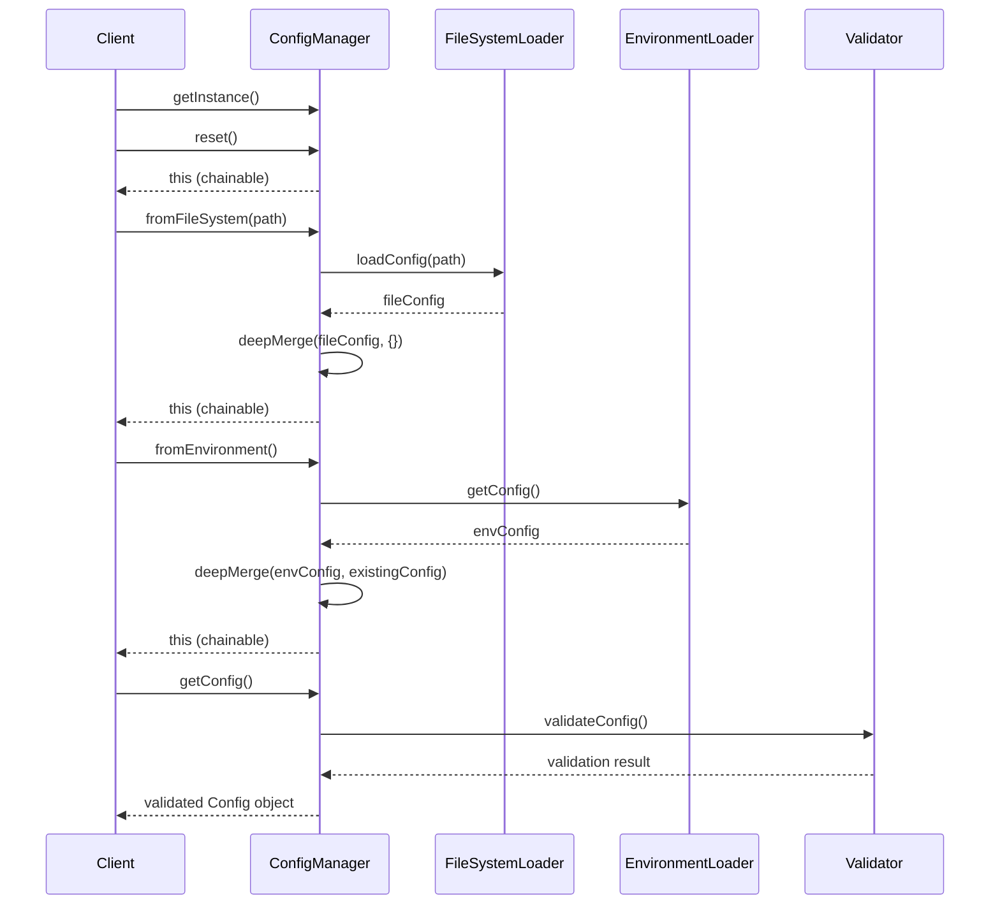

# Configuration Management System

This document explains the fluent chaining configuration system used in the Huron Person Integration project.

## Overview

The configuration system provides a flexible, chainable interface for loading configuration from multiple sources with configurable precedence. It follows the **fluent interface pattern** to enable method chaining and provides **automatic validation** to ensure configuration integrity.

## Key Components

- **`ConfigManager`**: Main orchestrator with fluent chaining interface
- **`ConfigFromFileSystem`**: Loads configuration from JSON files
- **`ConfigFromEnvironment`**: Loads configuration from environment variables
- **`ConfigValidator`**: Validates loaded configuration against schema
- **`Config`**: TypeScript interface defining the configuration structure

## Basic Usage

### Simple Configuration Loading

```typescript
import { ConfigManager } from './config/ConfigManager';

// Basic usage with default config file
const configManager = ConfigManager.getInstance();
const config = configManager
  .reset()
  .fromFileSystem()           // Loads from './config.json'
  .fromEnvironment()          // Applies environment overrides
  .getConfig();               // Returns validated config
```

### Custom Configuration File

```typescript
// Using custom config file path
const config = configManager
  .reset()
  .fromFileSystem('./custom-config.json')
  .fromEnvironment()
  .getConfig();
```

### Environment-Only Configuration

```typescript
// Load from environment variables only
const config = configManager
  .reset()
  .fromEnvironment()
  .getConfig();
```

## Configuration Precedence

The configuration system follows a **first-wins precedence model** where earlier sources in the chain take priority over later sources:

```typescript
const config = configManager
  .reset()
  .fromFileSystem()    // 🏆 HIGHEST PRIORITY
  .fromEnvironment()   // 📝 Overrides only missing values
  .getConfig();
```

### Precedence Example

If you have:
- **File config**: `{ apiKey: "file-key", timeout: 5000 }`
- **Environment config**: `{ apiKey: "env-key", retries: 3 }`

Result: `{ apiKey: "file-key", timeout: 5000, retries: 3 }`
- `apiKey` comes from file (higher precedence)
- `timeout` comes from file (only source)
- `retries` comes from environment (fills missing value)

## Configuration Flow



## Configuration Sources

### File System Configuration

Loads from JSON files with support for:
- Relative paths: `'./config.json'`, `'../shared-config.json'`
- Absolute paths: `'/etc/myapp/config.json'`
- Custom extensions: `'.config.json'`, `'.settings.json'`

```typescript
.fromFileSystem('./config.json')
.fromFileSystem('/absolute/path/config.json')
.fromFileSystem('../shared/config.json')
```

### Environment Variable Configuration

Automatically maps environment variables to configuration structure:

| Environment Variable | Configuration Path |
|---------------------|-------------------|
| **Data Source (BU CDM API)** | |
| `DATASOURCE_ENDPOINTCONFIG_BASE_URL` | `dataSource.endpointConfig.baseUrl` |
| `DATASOURCE_ENDPOINTCONFIG_API_KEY` | `dataSource.endpointConfig.apiKey` |
| `DATASOURCE_ENDPOINT_PERSON_PATH` | `dataSource.fetchPersonsPath` |
| **Data Target (Huron API)** | |
| `DATATARGET_ENDPOINTCONFIG_BASE_URL` | `dataTarget.endpointConfig.baseUrl` |
| `DATATARGET_ENDPOINTCONFIG_USERNAME` | `dataTarget.endpointConfig.username` |
| `DATATARGET_ENDPOINTCONFIG_PASSWORD` | `dataTarget.endpointConfig.password` |
| `DATATARGET_ENDPOINTCONFIG_LOGIN_SVC_PATH` | `dataTarget.endpointConfig.loginSvcPath` |
| `DATATARGET_ENDPOINTCONFIG_LOGIN_USERID` | `dataTarget.endpointConfig.userId` |
| `DATATARGET_ENDPOINTCONFIG_EXTERNAL_TOKEN` | `dataTarget.endpointConfig.externalToken` |
| **Integration Settings** | |
| `CLIENT_ID` | `integration.clientId` |
| `BATCH_SIZE` | `integration.batchSize` |
| `TIMEOUT` | `integration.timeout` |

## Best Practices

### 1. Always Start with reset()

```typescript
// ✅ Good - Ensures clean state
const config = configManager
  .reset()
  .fromFileSystem()
  .fromEnvironment()
  .getConfig();

// ❌ Bad - May have stale state from previous loads
const config = configManager
  .fromFileSystem()
  .getConfig();
```

### 2. Use Consistent Chaining Order

```typescript
// ✅ Recommended pattern - File first, then environment overrides
const config = configManager
  .reset()
  .fromFileSystem('./config.json')
  .fromEnvironment()
  .getConfig();
```

### 3. Handle Errors Appropriately

```typescript
try {
  const config = configManager
    .reset()
    .fromFileSystem('./config.json')
    .fromEnvironment()
    .getConfig();
} catch (error) {
  if (error.message.includes('Failed to load configuration from file system')) {
    // Handle file loading errors
    console.error('Config file not found or invalid:', error);
  } else if (error.message.includes('Configuration validation failed')) {
    // Handle validation errors
    console.error('Invalid configuration:', error);
  }
  throw error;
}
```

### 4. Environment-Specific Configurations

```typescript
// Development
const config = configManager
  .reset()
  .fromFileSystem('./config.dev.json')
  .fromEnvironment()
  .getConfig();

// Production
const config = configManager
  .reset()
  .fromFileSystem('./config.prod.json')
  .fromEnvironment()
  .getConfig();

// Testing (environment only)
const config = configManager
  .reset()
  .fromEnvironment()
  .getConfig();
```

## Advanced Usage

### Multiple File Sources

```typescript
// Load base config, then environment-specific overrides
const config = configManager
  .reset()
  .fromFileSystem('./config.base.json')    // Base configuration
  .fromFileSystem('./config.prod.json')    // Environment overrides
  .fromEnvironment()                       // Runtime overrides
  .getConfig();
```

### Configuration Validation

The system automatically validates configuration when `getConfig()` is called:

- **Schema validation**: Ensures all required fields are present
- **Type validation**: Validates field types and formats
- **Business rules**: Validates cross-field dependencies
- **URL validation**: Ensures valid URL formats for endpoints
- **Authentication validation**: Validates auth method configurations

### Future Extension Points

The ConfigManager includes placeholder methods for future configuration sources:

```typescript
// Future implementations
.fromS3()              // Load from AWS S3 bucket
.fromDatabase()        // Load from database
.fromSecretManager()   // Load from AWS Secrets Manager
```

## Error Handling

Common error scenarios and their handling:

| Error Type | Cause | Solution |
|------------|-------|----------|
| `File not found` | Config file doesn't exist | Check file path, create file, or use environment-only config |
| `Invalid JSON` | Malformed JSON in config file | Validate JSON syntax |
| `Validation failed` | Missing required fields | Check configuration completeness |
| `No configuration loaded` | Called getConfig() without loading any config | Call fromFileSystem() or fromEnvironment() first |

## Examples

### Production Application

```typescript
import { ConfigManager } from './config/ConfigManager';

class HuronPersonIntegration {
  private config: Config;

  constructor(configPath?: string) {
    const configManager = ConfigManager.getInstance();
    this.config = configManager
      .reset()
      .fromFileSystem(configPath || './config.json')
      .fromEnvironment()
      .getConfig();
  }
}
```

### Testing Environment

```typescript
// Test with mock environment variables
process.env.HURON_API_BASE_URL = 'https://test-api.example.com';
process.env.BU_CDM_API_KEY = 'test-key';

const config = ConfigManager.getInstance()
  .reset()
  .fromEnvironment()
  .getConfig();
```

### CLI Application

```typescript
#!/usr/bin/env node
import { ConfigManager } from './config/ConfigManager';

const configPath = process.argv[2] || './config.json';
const config = ConfigManager.getInstance()
  .reset()
  .fromFileSystem(configPath)
  .fromEnvironment()
  .getConfig();

console.log('Loaded configuration:', JSON.stringify(config, null, 2));
```

## Troubleshooting

### Configuration Not Loading
1. Verify file path exists and is accessible
2. Check JSON syntax with a validator
3. Ensure environment variables are set correctly
4. Review error messages for specific validation failures

### Precedence Issues
1. Remember: **first source wins** (earlier in chain has higher priority)
2. Use `reset()` to clear any previous state
3. Check the order of chained method calls

### Validation Errors
1. Compare your config against the expected schema
2. Check for missing required fields
3. Verify data types match expected values
4. Ensure URLs are properly formatted

## Configuration Schema

For the complete configuration schema and validation rules, see:
- `Config.ts` - TypeScript interface definitions
- `ConfigValidator.ts` - Validation logic and error messages