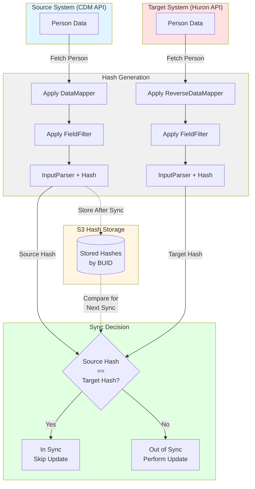

# Delta Storage Hash Management Utilities

This directory contains utilities for managing hash storage in delta synchronization workflows. Hash storage tracks the state of synchronized records to enable efficient incremental updates.

## Overview

The hash storage system maintains computed hashes of person records to determine whether source and target systems are in sync. These utilities allow you to reset or repair the hash storage when it becomes out of sync with the actual target system state.



## Utilities

### HashStorageReset

**Purpose**: Reset the hash storage for a **single person** to match their current state in the target system.

**Use Cases**:
- Manual correction of a specific person's hash after direct target modifications
- Debugging synchronization issues for individual records
- Testing hash storage behavior with known data

**Location**: [HashStorageReset.ts](./HashStorageReset.ts)

**Key Features**:
- Fetches current person state from target API
- Applies proper field filtering using source data mapper mappings
- Generates hash with same algorithm used during sync
- Updates hash storage for single BUID

**Usage**:
```bash
npx ts-node src/delta-storage/HashStorageReset.ts
```

**Required Environment Variables** (prefixed with `HASH_STORAGE_RESET_`):
- `INTEGRATED_DELTA_CLIENT_ID` - Delta storage client identifier
- `DELTA_STORAGE_BUCKET` - S3 bucket for delta storage
- `HURON_PERSON_SOURCE_ID` or `HURON_PERSON_HRN` - Person identifier (BUID or HRN)

**Optional**:
- `HURON_PERSON_CONFIG_PATH` - Custom config file path

**Example .env Configuration**:
```env
HASH_STORAGE_RESET_HURON_PERSON_SOURCE_ID=U01733060
HASH_STORAGE_RESET_HURON_PERSON_CONFIG_PATH=
HASH_STORAGE_RESET_INTEGRATED_DELTA_CLIENT_ID=delta-storage
HASH_STORAGE_RESET_DELTA_STORAGE_BUCKET=huron-person-chunks-staging
```

---

### HashStorageResetAll

**Purpose**: Reset the hash storage for **all people** in the target system.

**Use Cases**:
- Complete hash storage rebuild after schema changes
- Recovery from hash storage corruption
- Synchronization of hash storage with new target system instance
- Batch correction after bulk manual updates in target system

**Location**: [HashStorageResetAll.ts](./HashStorageResetAll.ts)

**Key Features**:
- Fetches ALL people from target API using efficient pagination (500 per page)
- Pre-filters API requests to exclude non-hashable fields (roles, __arrayFieldOperations)
- Validates BUID format before processing (must match `U` followed by 7+ digits)
- Uses `SourcePerson.getInput()` from SyncEvaluator for consistent hash generation
- Batch updates hash storage for all records
- Progress logging every 100 people
- Error handling continues processing if individual person fails

**Usage**:
```bash
npx ts-node src/delta-storage/HashStorageResetAll.ts
```

**Required Environment Variables** (prefixed with `HASH_STORAGE_RESET_ALL_`):
- `INTEGRATED_DELTA_CLIENT_ID` - Delta storage client identifier
- `DELTA_STORAGE_BUCKET` - S3 bucket for delta storage

**Optional**:
- `HURON_PERSON_CONFIG_PATH` - Custom config file path

**Example .env Configuration**:
```env
HASH_STORAGE_RESET_ALL_HURON_PERSON_CONFIG_PATH=
HASH_STORAGE_RESET_ALL_INTEGRATED_DELTA_CLIENT_ID=delta-storage
HASH_STORAGE_RESET_ALL_DELTA_STORAGE_BUCKET=huron-person-chunks-staging
```

**Warning**: This operation processes ALL people in the target system and can take significant time depending on population size. Use with caution in production environments.

---

## Implementation Details

### Hash Generation Process

Both utilities follow the same hash generation process used during normal sync operations:

1. **Fetch Data**: Retrieve person record(s) from target API
2. **Hash Generation**: Use `SourcePerson.getInput()` method which:
   - Applies `ReverseDataMapper` to convert target format to source-equivalent format
   - Applies `FieldFilter` to remove non-hashable fields (userId, roles, __arrayFieldOperations) and normalize mappings (states, countries, organizations)
   - Uses `InputParser` with field filter to generate final hashed `Input` format
3. **Storage Update**: Update S3-based hash storage with new hash values

**Note**: `HashStorageResetAll` optimizes API calls by pre-filtering requests to exclude non-hashable fields, reducing payload size and processing time.

### Field Filtering

Field filtering ensures hash consistency by:
- **Excluding non-deterministic fields**: userId, roles, __arrayFieldOperations
- **Normalizing mapped values**: State codes, country codes, organization IDs using mapper's lookup tables
- **Matching source data structure**: Ensures target-derived hashes match source-derived hashes

This filtering is critical - without it, hashes from target data would never match hashes from source data due to format differences.

### Source Data Mapper Requirement

Both utilities require a `sourceDataMapper` parameter initialized with full mappings:
```typescript
const sourceDataMapper = await getDataMapper(config, { 
  orgMap: true, 
  stateMap: true, 
  countryMap: true 
});
```

These mappings are used by `FieldFilter` to normalize target data to match source data structure before hashing.

---

## Related Modules

### SyncEvaluator

**Location**: [SyncEvaluator.ts](./SyncEvaluator.ts)

Provides the core hash comparison logic used during sync operations. Both hash reset utilities directly leverage this module's hash generation methods.

**Key Classes**:
- `SourcePerson` - Generates hashes from source or target API data
  - `getInput(dataMapper, person)` - **Used by HashStorageResetAll** to generate hashes with consistent field filtering
  - `getFilteredFields()` - Applies FieldFilter with sourceDataMapper mappings
- `getInputFromSource()` - Fetches and hashes source person
- `getInputFromTarget()` - Fetches and hashes target person
- `isInSyncWith()` - Compares source and target hashes

**Integration**: `HashStorageResetAll.getAllTargetPersons()` creates a `SourcePerson` instance for each fetched person and calls `getInput(targetDataMapper, person)` to ensure hash generation matches the sync algorithm exactly.

### HashStorageUpdater

**Location**: [HashStorageUpdater.ts](./HashStorageUpdater.ts)

Utility class for efficient batch updates to hash storage. Used by both reset utilities to write updated hashes to S3.

**Key Features**:
- Single read-modify-write cycle for batch updates
- Extracts primary key fields from Input format
- Updates multiple person hashes in one operation

---

## Troubleshooting

### Common Issues

**Issue**: Hash storage reset completes but sync still shows "out of sync"

**Solutions**:
1. Verify field filtering is applied correctly (check `FieldFilter` logic)
2. Ensure source data mapper has all mappings loaded (orgMap, stateMap, countryMap)
3. Check that excluded fields match `FieldFilter.ts` line 11 (userId, roles, __arrayFieldOperations)
4. Confirm S3 bucket and client ID match sync configuration

**Issue**: HashStorageResetAll takes too long

**Solutions**:
1. Target system population size determines duration (expect ~2-3 seconds per 100 people)
2. Monitor progress logs (logged every 100 people)
3. Consider running during low-traffic periods
4. Increase page size in `readAllPeopleNonTokenized` if API supports it

**Issue**: Some people fail to process in HashStorageResetAll

**Solutions**:
1. Check error logs for specific person IDs
2. Verify those people exist and are accessible in target API
3. Use HashStorageReset to manually fix specific failed records
4. Check for data quality issues (missing required fields, invalid formats)

---

## Testing

Both utilities include test harnesses that can be run directly:

```bash
# Test single person hash reset
HASH_STORAGE_RESET_HURON_PERSON_SOURCE_ID=U01733060 \
HASH_STORAGE_RESET_INTEGRATED_DELTA_CLIENT_ID=delta-storage \
HASH_STORAGE_RESET_DELTA_STORAGE_BUCKET=test-bucket \
npx ts-node src/delta-storage/HashStorageReset.ts

# Test all people hash reset (use test environment!)
HASH_STORAGE_RESET_ALL_INTEGRATED_DELTA_CLIENT_ID=delta-storage \
HASH_STORAGE_RESET_ALL_DELTA_STORAGE_BUCKET=test-bucket \
npx ts-node src/delta-storage/HashStorageResetAll.ts
```

**Important**: Always test in non-production environment first to verify expected behavior.

---

## Architecture Notes

### Why Field Filtering Matters

Hash storage tracks whether source and target are in sync by comparing computed hashes. However:
- **Source data** uses internal IDs, codes, and structures
- **Target data** uses display names, descriptions, and different structures

Without field filtering to normalize these differences, hashes would never match even when data is logically equivalent.

Example transformations:
- State: "Massachusetts" (target) → "MA" (source)
- Country: "United States" (target) → "US" (source)  
- Organization: "Academic Affairs" (target) → "10006707" (source ID)

Field filtering applies reverse mappings to convert target data back to source-equivalent format before hashing.

### Design Pattern: Composition and Code Reuse

`HashStorageResetAll` demonstrates two levels of composition:

**1. Module Composition**: Delegates storage updates to `HashStorageReset`
```typescript
// Fetch and convert all people to Input format
const targetPersonData: Input[] = await this.getAllTargetPersons();

// Delegate to HashStorageReset for storage update
const resetter = HashStorageReset.instanceFromData(config, targetPersonData);
await resetter.updateHashStorage();
```

**2. Hash Generation Reuse**: Uses `SourcePerson.getInput()` from SyncEvaluator
```typescript
// In getAllTargetPersons(), for each person:
const parsedInput = new SourcePerson({
  config, sourceDataMapper
}).getInput(targetDataMapper, person);
```

This DRY approach ensures:
- Hash generation logic is identical to sync operations
- Field filtering uses the same `getFilteredFields()` method
- Changes to hash algorithm automatically propagate to reset utilities
