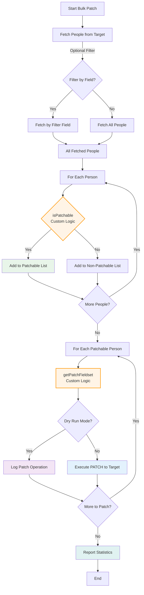

# Bulk Target Patching

## Overview

This directory contains scripts and utilities for performing bulk patching operations on the target system. The `AbstractBulkTargetPatcher` class provides a template for fetching, filtering, and patching people in bulk, while allowing for custom logic to be implemented for determining patchable people and generating the necessary field sets for updates.



## Implementations

### AbstractBulkTargetPatcher (Base Class)

The abstract base class that defines the template method pattern for bulk patching operations. Subclasses must implement two abstract methods:

- **`isPatchable(person: HuronPerson): Promise<boolean>`** - Determines whether a specific person should be included in the patch operation
- **`getPatchFieldset(person: HuronPerson): Promise<FieldSet>`** - Generates the field values to patch for a specific person

### BulkTargetPatcherForSourceIdentifier

**Purpose**: Backfill `sourceIdentifier` field for people who have a BUID (Boston University ID) in their `id` or `employeeId` field but are missing a valid `sourceIdentifier`.

**Use Case**: Useful for migrating legacy data where people were created before sourceIdentifier population was implemented.

**Logic**:
- **isPatchable**: Returns true if person has a BUID pattern (`U` + 8 digits) in `id` or `employeeId` AND doesn't have a valid `sourceIdentifier`
- **getPatchFieldset**: Sets `sourceIdentifier` to the BUID value found in `id` or `employeeId`

**Environment Variables**:
- `BULK_TARGET_PATCHER_SOURCE_IDENTIFIER_*` prefix
- Standard variables: `CACHE_ENABLED`, `CACHE_PATH`, `HURON_PERSON_CONFIG_PATH`, `SECRET_ARN`, `DRY_RUN`

**Example**:
```bash
export CACHE_ENABLED="true"
export CACHE_PATH="./integration-cache.json"
export DRY_RUN="true"
npx ts-node src/miscellaneous/bulk-patching/BulkTargetPatcherForSourceIdentifier.ts
```

### BulkTargetPatcherForRetirement

**Purpose**: Retire people by setting them to inactive and assigning them to the UNASSIGNED organization. Uses an exclusion file containing personids that should NOT be retired.

**Use Case**: Mass retirement of employees while preserving specific individuals (e.g., maintaining active status for certain employees during a bulk retirement operation).

**Logic**:
- **isPatchable**: Returns false if person's `id` exists in the exclusion file (keep active), true otherwise (should be retired)
- **getPatchFieldset**: Sets three fields:
  - `active`: false
  - `employer`: { hrn: `<UNASSIGNED org HRN>` }
  - `organization`: { hrn: `<UNASSIGNED org HRN>` }

**Exclusion File Format**: Plain text file with one personid per line. These personids will be EXCLUDED from retirement (i.e., kept active).

**UNASSIGNED Organization**: The patcher automatically looks up the organization with `sourceIdentifier` = "UNASSIGNED" and uses its HRN for the employer and organization fields.

**Environment Variables**:
- `BULK_TARGET_PATCHER_FOR_RETIREMENT_*` prefix
- `PERSON_ID_FILE` - Path to file containing personids to exclude from retirement
- Standard variables: `CACHE_ENABLED`, `CACHE_PATH`, `HURON_PERSON_CONFIG_PATH`, `SECRET_ARN`, `DRY_RUN`

**Example**:
```bash
export CACHE_ENABLED="true"
export CACHE_PATH="./integration-cache.json"
export PERSON_ID_FILE="./active-employees.txt"
export DRY_RUN="true"
npx ts-node src/miscellaneous/bulk-patching/BulkTargetPatcherForRetirement.ts
```

**Example Exclusion File** (`active-employees.txt`):
```
U12345678
U87654321
U11111111
```

## Creating New Bulk Patchers

To create a new bulk patcher:

1. Create a new class extending `AbstractBulkTargetPatcher`
2. Implement `isPatchable()` method with your filtering logic
3. Implement `getPatchFieldset()` method to generate the patch data
4. Add a static `runPatcher()` method for convenience
5. Add harness block with `TestEnvironment` for standalone execution
6. Define required environment variables using the harness prefix pattern

**Example skeleton**:
```typescript
export class MyCustomPatcher extends AbstractBulkTargetPatcher {
  public isPatchable = async (person: HuronPerson): Promise<boolean> => {
    // Your filtering logic here
    return true;
  }

  public getPatchFieldset = async (person: HuronPerson): Promise<FieldSet> => {
    // Your patch data generation here
    return { fieldValues: [
      { 'fieldName': 'newValue' }
    ]} as FieldSet;
  }

  public static runPatcher = async (config: Config, dryRun: boolean): Promise<void> => {
    const patcher = new MyCustomPatcher(config, { /* SelectConfig */ }, dryRun);
    await patcher.patchPeople();
  }
}
```

