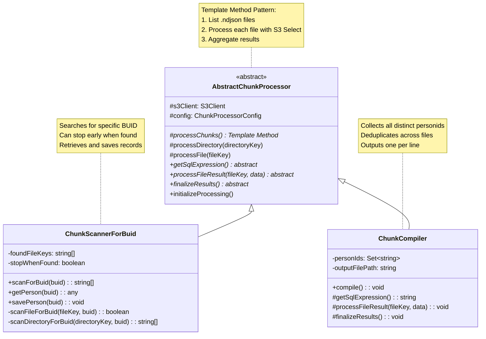

# Chunk Processing

## Overview

This directory contains utilities for processing NDJSON chunk files stored in AWS S3. The modules use the **Template Method design pattern** to provide a flexible framework for different types of chunk processing operations while eliminating code duplication.



## Architecture: Template Method Pattern

The **AbstractChunkProcessor** base class defines the skeleton algorithm for processing chunk files:

1. **Initialize** - Set up data structures and state
2. **List Files** - Enumerate all .ndjson files in S3 directory (with pagination)
3. **Process Each File** - Execute S3 Select query and process results
4. **Finalize** - Aggregate results and present output

Subclasses implement the variable parts:
- `getSqlExpression()` - The SQL query to run against each file
- `processFileResult(fileKey, data)` - How to handle results from each file
- `finalizeResults()` - How to aggregate and present final results
- `initializeProcessing()` - Optional setup before processing

## Modules

### AbstractChunkProcessor.ts

Base class implementing the Template Method pattern. Provides:
- S3 client initialization and configuration management
- Directory listing with pagination support
- S3 Select query execution with event stream processing
- File iteration orchestration

**Not meant to be instantiated directly** - extend this class to create specific processors.

### ChunkScannerForBuid.ts

This class is an example of one of the implementations *(there may be others in this directory)*.<br>
It searches for specific person records by BUID in chunk files. Features:
- **Scan mode**: Find which file(s) contain a specific BUID
- **Retrieve mode**: Get full person record for a BUID
- **Save mode**: Save person record to local JSON file
- **Early termination**: Can stop scanning after first match (configurable)

**Use Case**: "Find the chunk file containing person U12345678" or "Extract person U12345678's full record"

**Environment Variables**:
- `CHUNK_SCANNER_FOR_BUID_BUCKET` - S3 bucket name
- `CHUNK_SCANNER_FOR_BUID_KEY` - S3 file or directory path (directory must end with `/`)
- `CHUNK_SCANNER_FOR_BUID_REGION` - AWS region (default: `us-east-2`)
- `CHUNK_SCANNER_FOR_BUID_BUID` - Person ID to search for
- `CHUNK_SCANNER_FOR_BUID_STOP_WHEN_FOUND` - Stop after first match? (`true`/`false`, default: `true`)
- `CHUNK_SCANNER_FOR_BUID_TASK` - Operation to perform (`scan` or `save`, default: `scan`)

**Example**:
```bash
export CHUNK_SCANNER_FOR_BUID_BUCKET="my-bucket"
export CHUNK_SCANNER_FOR_BUID_KEY="chunks/2024-01-15/"
export CHUNK_SCANNER_FOR_BUID_BUID="U12345678"
export CHUNK_SCANNER_FOR_BUID_TASK="scan"
npx ts-node src/miscellaneous/chunk-processing/ChunkScannerForBuid.ts
```

### ChunkCompiler.ts

Collects all distinct person IDs from chunk files in a directory and saves them to a file (one personid per line).

**Use Case**: "Get a complete list of all person IDs across all chunk files in this directory"

**Features**:
- Processes all .ndjson files in specified S3 directory
- Deduplicates personids across all files (uses Set)
- Outputs sorted list to local file (one per line)
- Handles pagination for large directories

**Environment Variables**:
- `CHUNK_COMPILER_BUCKET` - S3 bucket name
- `CHUNK_COMPILER_KEY` - S3 directory path (must end with `/`)
- `CHUNK_COMPILER_REGION` - AWS region (default: `us-east-2`)
- `CHUNK_COMPILER_OUTPUT_FILE` - Local output file path (default: `compiled-personids.txt`)

**Example**:
```bash
export CHUNK_COMPILER_BUCKET="my-bucket"
export CHUNK_COMPILER_KEY="chunks/2024-01-15/"
export CHUNK_COMPILER_OUTPUT_FILE="all-personids.txt"
npx ts-node src/miscellaneous/chunk-processing/ChunkCompiler.ts
```

## Design Decisions

### Why Template Method Pattern?

The Template Method pattern was chosen because:
1. **Substantial shared logic** - S3 client setup, directory pagination, S3 Select execution, and event stream processing are identical across use cases
2. **Clear variation points** - The SQL query and result processing differ, but the overall flow is the same
3. **Extensibility** - New chunk processors can be added by extending AbstractChunkProcessor and implementing 3-4 methods
4. **Code reuse** - Eliminates duplication while maintaining separation of concerns

### ChunkScanner Hybrid Approach

ChunkScanner extends AbstractChunkProcessor but doesn't fully use the template method for its main logic because:
- It needs **early termination** capability (stop when BUID found)
- It has **stateful searching** that doesn't fit the "process all files" model
- It provides multiple modes (scan, retrieve, save) with different workflows

ChunkScanner still inherits S3 client management and could optionally use shared utility methods in future refactoring.

### Deduplication Strategy

ChunkCompiler uses in-memory Set for deduplication rather than relying on `SELECT DISTINCT` per file because:
- **Cross-file deduplication** - The same personid may appear in multiple chunk files
- **Simpler SQL** - `SELECT personid` is simpler and potentially faster than `SELECT DISTINCT personid`
- **Flexibility** - Application-level deduplication gives more control over output format and sorting

## Adding New Processors

To create a new chunk processor:

1. Create a new class extending `AbstractChunkProcessor`
2. Implement required abstract methods:
   ```typescript
   protected getSqlExpression(): string {
     return 'SELECT ... FROM s3object s WHERE ...';
   }
   
   protected async processFileResult(fileKey: string, data: string): Promise<void> {
     // Handle results from this file
   }
   
   protected async finalizeResults(): Promise<void> {
     // Aggregate and output final results
   }
   ```
3. Optionally override `initializeProcessing()` for setup
4. Add public methods for your specific use case
5. Add harness block with TestEnvironment for standalone execution

**Example Use Cases**:
- Extract all unique email addresses from chunks
- Count total records across all chunks
- Validate chunk structure and report errors
- Extract records matching complex criteria
- Generate statistics about chunk contents
