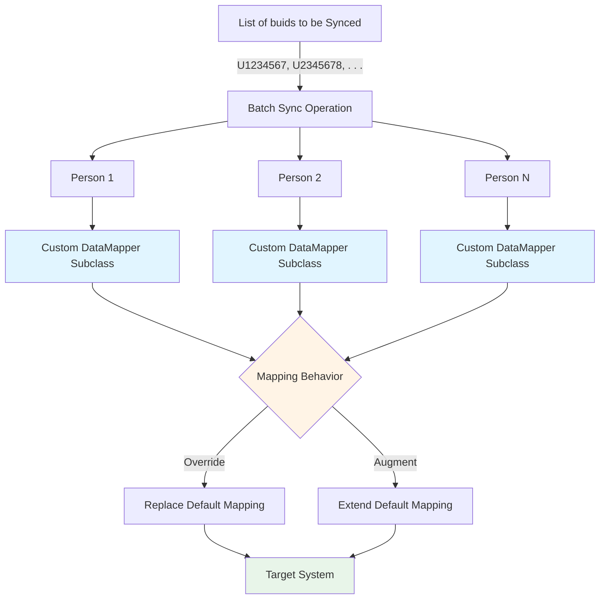

# Custom Mapping Batched Sync Operations

## Overview

This directory contains scripts and utilities for carrying out synchronization operations for multiple people in batch mode. What would have been a standard synchronization for each person is modified by injecting custom subclass implementations of the data mapper, allowing for the overriding or augmentation of the default mapping behavior.



## Modules

### SyncPersonBatchUnassignedOrgEnforcer.ts

**Purpose:** Enforces UNASSIGNED organization assignment for people not present in the authorized population.

**Problem:** The PersonFull population (bulk endpoint) may not contain all individuals that can be looked up via the single-person endpoint. When syncing individuals not in PersonFull, the single-person endpoint returns their actual organization/employer data without knowing they should be excluded from the active population, resulting in incorrect assignments.

**Solution:** Loads authorized BUIDs from a text file (one per line) and checks each person during mapping. For people NOT in the authorized set:
- Sets organization to `lookup:sourceIdentifier:UNASSIGNED`
- Sets employer to `lookup:sourceIdentifier:UNASSIGNED`
- Sets active to `false`

**Usage:**
```bash
SYNC_PERSON_BATCH_UNASSIGNED_ORG_ENFORCER_AUTHORIZED_BUIDS_FILE_PATH=./authorized-buids.txt
SYNC_PERSON_BATCH_UNASSIGNED_ORG_ENFORCER_SYNC_BUIDS_FILE_PATH=./buids-to-sync.txt
npx ts-node src/miscellaneous/custom-mapping/SyncPersonBatchUnassignedOrgEnforcer.ts
```

**Authorized BUIDs File Format:**
```
# Lines starting with # are comments
# One BUID per line
U12345678
U23456789
U34567890
```

