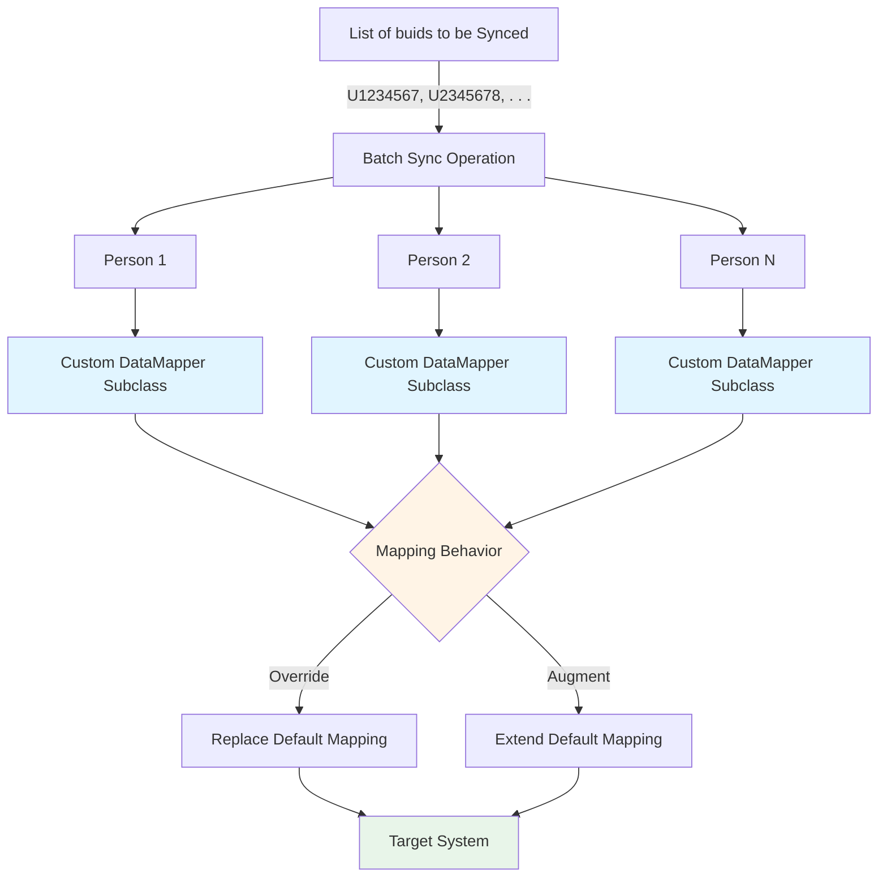

# Custom Mapping Batched Sync Operations

## Overview

This directory contains scripts and utilities for carrying out synchronization operations for multiple people in batch mode. What would have been a standard synchronization for each person is modified by injecting custom subclass implementations of the data mapper, allowing for the overriding or augmentation of the default mapping behavior.

