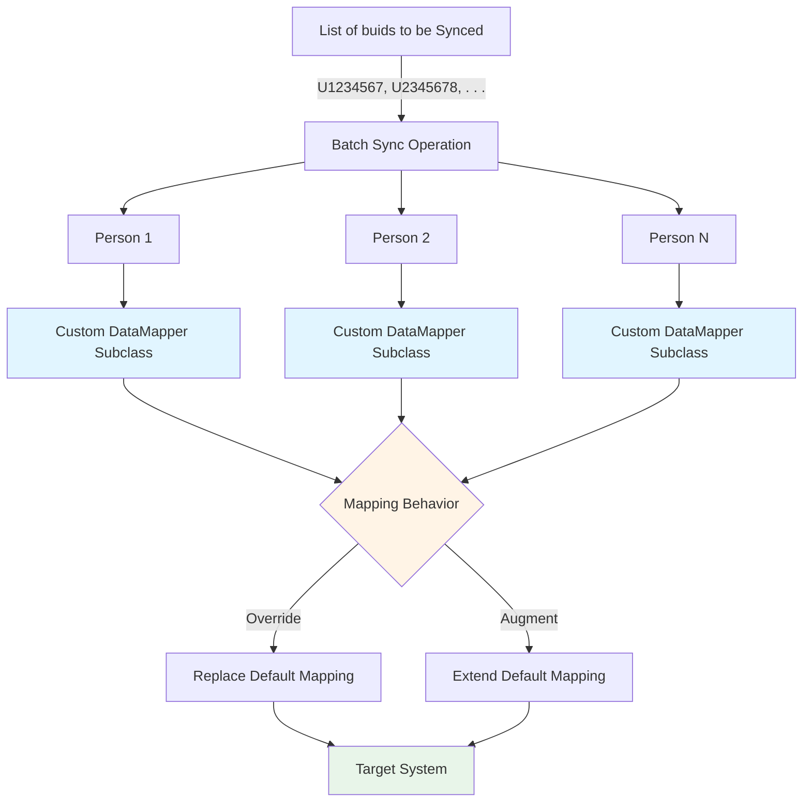

# Custom Mapping Batched Sync Operations

## Overview

This directory contains scripts and utilities for carrying out synchronization operations for multiple people in batch mode. What would have been a standard synchronization for each person is modified by injecting custom subclass implementations of the data mapper, allowing for the overriding or augmentation of the default mapping behavior.



## Modules

### SyncPersonBatchCustomOrg.ts

**Purpose:** Overrides organization and/or employer fields with fixed HRNs for all records in the batch.

**Problem:** Source data may not contain reliable organization/employer identifiers, or you may need to force all records to be associated with specific organizations regardless of source data.

**Solution:** Extends the standard DataMapper to inject custom organization and/or employer HRNs into all mapped person records. Supports lookup by HRN or source identifier.

**Usage:**
```bash
# Using HRNs directly
SYNC_PERSON_BATCH_CUSTOM_ORG_ORGANIZATION_HRN=hrn:hrs:lists:organizations/MY-ORG
SYNC_PERSON_BATCH_CUSTOM_ORG_EMPLOYER_HRN=hrn:hrs:lists:organizations/MY-EMPLOYER
SYNC_PERSON_BATCH_CUSTOM_ORG_SYNC_BUIDS=U12345678,U23456789
npx ts-node src/miscellaneous/custom-mapping/SyncPersonBatchCustomOrg.ts

# Using source identifiers
SYNC_PERSON_BATCH_CUSTOM_ORG_ORGANIZATION_SID=MY-ORG-ID
SYNC_PERSON_BATCH_CUSTOM_ORG_EMPLOYER_SID=MY-EMPLOYER-ID
SYNC_PERSON_BATCH_CUSTOM_ORG_SYNC_BUIDS_FILE_PATH=./buids-to-sync.txt
npx ts-node src/miscellaneous/custom-mapping/SyncPersonBatchCustomOrg.ts
```

**Environment Variables:**
- `ORGANIZATION_HRN` / `ORGANIZATION_SID` - Organization to assign
- `EMPLOYER_HRN` / `EMPLOYER_SID` - Employer to assign
- `SYNC_BUIDS` or `SYNC_BUIDS_FILE_PATH` - People to sync
- `SYNC_PREVIEW` - Preview mode (default: false)
- `SYNC_UPDATE_HASH` - Update hash storage (default: false)

---

### SyncPersonBatchCustomRolePatcher.ts

**Purpose:** Applies the same role(s) to ALL people being synced in the batch.

**Problem:** Need to assign uniform roles across multiple people, either replacing existing roles or appending to them.

**Solution:** Extends the standard DataMapper to inject the same custom role HRNs into all mapped person records. Supports both replace and append modes via the REPLACE flag, and controls whether to use only custom roles or combine with source data via the OVERRIDE flag.

**Usage:**
```bash
# Append custom roles to existing roles (combine with source data)
SYNC_PERSON_BATCH_CUSTOM_ROLE_PATCHER_ROLE_HRNS=hrn:hrs:lists:roles/custom-role-1,hrn:hrs:lists:roles/custom-role-2
SYNC_PERSON_BATCH_CUSTOM_ROLE_PATCHER_REPLACE=false
SYNC_PERSON_BATCH_CUSTOM_ROLE_PATCHER_OVERRIDE=false
SYNC_PERSON_BATCH_CUSTOM_ROLE_PATCHER_SYNC_BUIDS=U12345678,U23456789
npx ts-node src/miscellaneous/custom-mapping/SyncPersonBatchCustomRolePatcher.ts

# Replace all existing roles with custom roles only
SYNC_PERSON_BATCH_CUSTOM_ROLE_PATCHER_ROLE_HRNS=hrn:hrs:lists:roles/admin-role
SYNC_PERSON_BATCH_CUSTOM_ROLE_PATCHER_REPLACE=true
SYNC_PERSON_BATCH_CUSTOM_ROLE_PATCHER_OVERRIDE=true
SYNC_PERSON_BATCH_CUSTOM_ROLE_PATCHER_SYNC_UPDATE_HASH=true
SYNC_PERSON_BATCH_CUSTOM_ROLE_PATCHER_SYNC_BUIDS_FILE_PATH=./buids-to-sync.txt
npx ts-node src/miscellaneous/custom-mapping/SyncPersonBatchCustomRolePatcher.ts
```

**Environment Variables:**
- `ROLE_HRNS` - Comma-separated role HRNs to assign (required)
- `REPLACE` - `true` = replace all target roles, `false` = append to target roles (required)
- `OVERRIDE` - `true` = use only custom roles (ignore source), `false` = combine with source roles (required)
- `SYNC_BUIDS` or `SYNC_BUIDS_FILE_PATH` - People to sync
- `SYNC_UPDATE_HASH` - Update hash storage (recommended: true for role updates)

**Flag Behavior:**

| REPLACE | OVERRIDE | Behavior |
|---------|----------|----------|
| `false` | `false` | Appends custom roles to existing target roles, combines with source roles (default) |
| `false` | `true` | Appends only custom roles (ignores source data roles) |
| `true` | `false` | Replaces all target roles with source + custom roles combined |
| `true` | `true` | Replaces all target roles with only custom roles |

**Note:** Uses `forceUpdate=true` to bypass hash comparison since roles are excluded from hashing (see [FieldFilter.ts](../../data-mapper/FieldFilter.ts)).

---

### SyncPersonBatchCustomRoleAssignment.ts

**Purpose:** Assigns specific roles to specific people from a JSON configuration file.

**Problem:** Need to assign different roles to different individuals, with granular control over who gets which roles.

**Solution:** Loads role assignments from a JSON file mapping BUIDs to role HRNs. Extends the standard DataMapper to inject person-specific custom role assignments. Supports both replace and append modes, and controls whether to use only custom roles or combine with source data.

**Usage:**
```bash
# Create role assignments file
cat > custom-role-assignments.json << EOF
[
  {
    "buid": "U12345678",
    "name": "John Doe",
    "role-hrns": ["hrn:hrs:lists:roles/admin", "hrn:hrs:lists:roles/reviewer"],
    "completed": false
  },
  {
    "buid": "U23456789",
    "name": "Jane Smith",
    "role-hrns": ["hrn:hrs:lists:roles/coordinator"],
    "completed": false
  }
]
EOF

# Run with append mode (combine with source roles)
SYNC_PERSON_BATCH_CUSTOM_ROLE_ASSIGN_ROLES_FILE_PATH=./custom-role-assignments.json
SYNC_PERSON_BATCH_CUSTOM_ROLE_ASSIGN_REPLACE=false
SYNC_PERSON_BATCH_CUSTOM_ROLE_ASSIGN_OVERRIDE=false
SYNC_PERSON_BATCH_CUSTOM_ROLE_ASSIGN_SYNC_UPDATE_HASH=true
npx ts-node src/miscellaneous/custom-mapping/SyncPersonBatchCustomRoleAssignment.ts

# Run with replace mode (custom roles only)
SYNC_PERSON_BATCH_CUSTOM_ROLE_ASSIGN_REPLACE=true
SYNC_PERSON_BATCH_CUSTOM_ROLE_ASSIGN_OVERRIDE=true
npx ts-node src/miscellaneous/custom-mapping/SyncPersonBatchCustomRoleAssignment.ts
```

**Environment Variables:**
- `ROLES_FILE_PATH` - Path to JSON file with role assignments (required)
- `REPLACE` - `true` = replace all target roles, `false` = append to target roles (required)
- `OVERRIDE` - `true` = use only custom roles (ignore source), `false` = combine with source roles (required)
- `SYNC_UPDATE_HASH` - Update hash storage (recommended: true for role updates)

**JSON File Format:**
```json
[
  {
    "buid": "U12345678",
    "name": "Optional display name",
    "role-hrns": [
      "hrn:hrs:lists:roles/role-1",
      "hrn:hrs:lists:roles/role-2"
    ],
    "completed": false
  }
]
```

**Note:** 
- Only entries with `"completed": false` (or missing) are processed
- `SYNC_BUIDS` is automatically generated from the file
- Uses `forceUpdate=true` to bypass hash comparison since roles are excluded from hashing

---

### SyncPersonBatchUnassignedOrgEnforcer.ts

**Purpose:** Enforces UNASSIGNED organization assignment for people not present in the authorized population.

**Problem:** The PersonFull population (bulk endpoint) may not contain all individuals that can be looked up via the single-person endpoint. When syncing individuals not in PersonFull, the single-person endpoint returns their actual organization/employer data without knowing they should be excluded from the active population, resulting in incorrect assignments.

**Solution:** Loads authorized BUIDs from a text file (one per line) and checks each person during mapping. For people NOT in the authorized set:
- Sets organization to `lookup:sourceIdentifier:UNASSIGNED`
- Sets employer to `lookup:sourceIdentifier:UNASSIGNED`
- Sets active to `false`

**Usage:**
```bash
SYNC_PERSON_BATCH_UNASSIGNED_ORG_ENFORCER_AUTHORIZED_BUIDS_FILE_PATH=./authorized-buids.txt
SYNC_PERSON_BATCH_UNASSIGNED_ORG_ENFORCER_SYNC_BUIDS_FILE_PATH=./buids-to-sync.txt
npx ts-node src/miscellaneous/custom-mapping/SyncPersonBatchUnassignedOrgEnforcer.ts
```

**Authorized BUIDs File Format:**
```
# Lines starting with # are comments
# One BUID per line
U12345678
U23456789
U34567890
```

