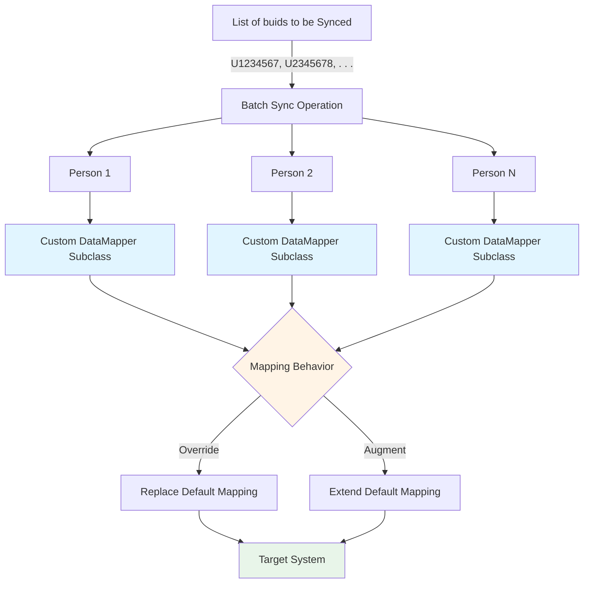

# Custom Mapping Batched Sync Operations

## Overview

This directory contains scripts and utilities for carrying out synchronization operations for multiple people in batch mode. What would have been a standard synchronization for each person is modified by injecting custom subclass implementations of the data mapper, allowing for the overriding or augmentation of the default mapping behavior.



## Modules

### SyncPersonBatchCustomOrg.ts

**Purpose:** Overrides organization and/or employer fields with fixed HRNs for all records in the batch.

**Problem:** Source data may not contain reliable organization/employer identifiers, or you may need to force all records to be associated with specific organizations regardless of source data.

**Solution:** Extends the standard DataMapper to inject custom organization and/or employer HRNs into all mapped person records. Supports lookup by HRN or source identifier.

**Environment Variables** (all prefixed with `SYNC_PERSON_BATCH_CUSTOM_ORG_`):
- `ORGANIZATION_HRN` / `ORGANIZATION_SID` - Organization to assign (HRN or source ID)
- `EMPLOYER_HRN` / `EMPLOYER_SID` - Employer to assign (HRN or source ID)
- `SYNC_BUIDS` - Comma-separated list of BUIDs to sync
- `SYNC_BUIDS_FILE_PATH` - Path to file with BUIDs (one per line)
- `SYNC_PREVIEW` - Preview mode, no actual updates (true/false)
- `SYNC_UPDATE_HASH` - Update hash storage after sync (true/false)
- `INTEGRATED_DELTA_CLIENT_ID` - Delta storage client identifier
- `DELTA_STORAGE_BUCKET` - S3 bucket for delta storage
- `OUTPUT_FILE_PATH` - Path for output log file
- `HURON_PERSON_CONFIG_PATH` - Custom config file path (optional)

**Usage:**
```bash
# Example .env configuration (using HRNs directly)
SYNC_PERSON_BATCH_CUSTOM_ORG_ORGANIZATION_HRN=hrn:hrs:lists:organizations/MY-ORG
SYNC_PERSON_BATCH_CUSTOM_ORG_EMPLOYER_HRN=hrn:hrs:lists:organizations/MY-EMPLOYER
SYNC_PERSON_BATCH_CUSTOM_ORG_SYNC_BUIDS=U12345678,U23456789
SYNC_PERSON_BATCH_CUSTOM_ORG_SYNC_PREVIEW=false
SYNC_PERSON_BATCH_CUSTOM_ORG_SYNC_UPDATE_HASH=false
SYNC_PERSON_BATCH_CUSTOM_ORG_INTEGRATED_DELTA_CLIENT_ID=delta-storage
SYNC_PERSON_BATCH_CUSTOM_ORG_DELTA_STORAGE_BUCKET=my-bucket
SYNC_PERSON_BATCH_CUSTOM_ORG_OUTPUT_FILE_PATH=data/output.json

# Run the sync
npx ts-node src/miscellaneous/custom-mapping/SyncPersonBatchCustomOrg.ts
```

---

### SyncPersonBatchCustomRolePatcher.ts

**Purpose:** Applies the same role(s) to ALL people being synced in the batch.

**Problem:** Need to assign uniform roles across multiple people, either replacing existing roles or appending to them.

**Solution:** Extends the standard DataMapper to inject the same custom role HRNs into all mapped person records. Supports both replace and append modes via the REPLACE flag, and controls whether to use only custom roles or combine with source data via the OVERRIDE flag.

**Environment Variables** (all prefixed with `SYNC_PERSON_BATCH_CUSTOM_ROLE_PATCHER_`):
- `ROLE_HRNS` - Comma-separated role HRNs to assign (required)
- `REPLACE` - Replace existing roles (`true`) or append (`false`, default)
- `OVERRIDE` - Use only custom roles (`true`) or combine with source (`false`, default)
- `SYNC_BUIDS` - Comma-separated list of BUIDs to sync
- `SYNC_BUIDS_FILE_PATH` - Path to file with BUIDs (one per line)
- `SYNC_PREVIEW` - Preview mode, no actual updates (true/false)
- `SYNC_UPDATE_HASH` - Update hash storage (recommended: `true` for role updates)
- `INTEGRATED_DELTA_CLIENT_ID` - Delta storage client identifier
- `DELTA_STORAGE_BUCKET` - S3 bucket for delta storage
- `OUTPUT_FILE_PATH` - Path for output log file
- `HURON_PERSON_CONFIG_PATH` - Custom config file path (optional)

**Usage:**
```bash
# Example .env configuration (append mode, combine with source)
SYNC_PERSON_BATCH_CUSTOM_ROLE_PATCHER_ROLE_HRNS=hrn:hrs:lists:roles/custom-role-1,hrn:hrs:lists:roles/custom-role-2
SYNC_PERSON_BATCH_CUSTOM_ROLE_PATCHER_REPLACE=false
SYNC_PERSON_BATCH_CUSTOM_ROLE_PATCHER_OVERRIDE=false
SYNC_PERSON_BATCH_CUSTOM_ROLE_PATCHER_SYNC_BUIDS=U12345678,U23456789
SYNC_PERSON_BATCH_CUSTOM_ROLE_PATCHER_SYNC_PREVIEW=false
SYNC_PERSON_BATCH_CUSTOM_ROLE_PATCHER_SYNC_UPDATE_HASH=true
SYNC_PERSON_BATCH_CUSTOM_ROLE_PATCHER_INTEGRATED_DELTA_CLIENT_ID=delta-storage
SYNC_PERSON_BATCH_CUSTOM_ROLE_PATCHER_DELTA_STORAGE_BUCKET=my-bucket
SYNC_PERSON_BATCH_CUSTOM_ROLE_PATCHER_OUTPUT_FILE_PATH=data/output.json

# Run the sync
npx ts-node src/miscellaneous/custom-mapping/SyncPersonBatchCustomRolePatcher.ts
```

**Flag Behavior:**

| REPLACE | OVERRIDE | Behavior |
|---------|----------|----------|
| `false` | `false` | Appends custom roles to existing target roles, combines with source roles (default) |
| `false` | `true` | Appends only custom roles (ignores source data roles) |
| `true` | `false` | Replaces all target roles with source + custom roles combined |
| `true` | `true` | Replaces all target roles with only custom roles |

**Note:** Uses `forceUpdate=true` to bypass hash comparison since roles are excluded from hashing (see [FieldFilter.ts](../../data-mapper/FieldFilter.ts)).

---

### SyncPersonBatchCustomRoleAssignment.ts

**Purpose:** Assigns specific roles to specific people from a JSON configuration file.

**Problem:** Need to assign different roles to different individuals, with granular control over who gets which roles.

**Solution:** Loads role assignments from a JSON file mapping BUIDs to role HRNs. Extends the standard DataMapper to inject person-specific custom role assignments. Supports both replace and append modes, and controls whether to use only custom roles or combine with source data.

**Environment Variables** (all prefixed with `SYNC_PERSON_BATCH_CUSTOM_ROLE_ASSIGN_`):
- `ROLES_FILE_PATH` - Path to JSON file with role assignments (required)
- `REPLACE` - Replace existing roles (`true`) or append (`false`, default)
- `OVERRIDE` - Use only custom roles (`true`) or combine with source (`false`, default)
- `SYNC_PREVIEW` - Preview mode, no actual updates (true/false)
- `SYNC_UPDATE_HASH` - Update hash storage (recommended: `true` for role updates)
- `INTEGRATED_DELTA_CLIENT_ID` - Delta storage client identifier
- `DELTA_STORAGE_BUCKET` - S3 bucket for delta storage
- `OUTPUT_FILE_PATH` - Path for output log file
- `HURON_PERSON_CONFIG_PATH` - Custom config file path (optional)

**JSON File Format:**
```json
[
  {
    "buid": "U12345678",
    "name": "Optional display name",
    "role-hrns": [
      "hrn:hrs:lists:roles/role-1",
      "hrn:hrs:lists:roles/role-2"
    ],
    "completed": false
  }
]
```

**Usage:**
```bash
# Create role assignments file (see JSON format above)
# Example .env configuration
SYNC_PERSON_BATCH_CUSTOM_ROLE_ASSIGN_ROLES_FILE_PATH=./custom-role-assignments.json
SYNC_PERSON_BATCH_CUSTOM_ROLE_ASSIGN_REPLACE=false
SYNC_PERSON_BATCH_CUSTOM_ROLE_ASSIGN_OVERRIDE=false
SYNC_PERSON_BATCH_CUSTOM_ROLE_ASSIGN_SYNC_PREVIEW=false
SYNC_PERSON_BATCH_CUSTOM_ROLE_ASSIGN_SYNC_UPDATE_HASH=true
SYNC_PERSON_BATCH_CUSTOM_ROLE_ASSIGN_INTEGRATED_DELTA_CLIENT_ID=delta-storage
SYNC_PERSON_BATCH_CUSTOM_ROLE_ASSIGN_DELTA_STORAGE_BUCKET=my-bucket
SYNC_PERSON_BATCH_CUSTOM_ROLE_ASSIGN_OUTPUT_FILE_PATH=data/output.json

# Run the sync
npx ts-node src/miscellaneous/custom-mapping/SyncPersonBatchCustomRoleAssignment.ts
```

**Note:** 
- Only entries with `"completed": false` (or missing) are processed
- `SYNC_BUIDS` is automatically generated from the file
- Uses `forceUpdate=true` to bypass hash comparison since roles are excluded from hashing

---

### SyncPersonBatchCustomLegacySeeder.ts

**Purpose:** Appends legacy role assignments to specific people after organization enforcement. Designed for decorator chaining with UnassignedOrgEnforcer.

**Problem:** Need to seed legacy roles for specific people while also enforcing organization assignment rules. Want to compose org enforcement + legacy role seeding in a single operation.

**Solution:** Implements the Decorator pattern to wrap another DataMapper (typically UnassignedOrgEnforcer). Loads BUID-to-roles mappings from a file or string, calls the inner mapper to get org-enforced data, then appends legacy roles for matching BUIDs. Supports decorator chaining to enable complex multi-step transformations. Supports both replace and append modes for roles, and controls whether to use only custom roles or combine with source data.

**Decorator Chaining Architecture:**
```
StandardMapper → UnassignedOrgEnforcer → CustomLegacySeeder → (optional) other decorators
```

**Environment Variables** (all prefixed with `SYNC_PERSON_BATCH_CUSTOM_LEGACY_SEEDER_`):
- `AUTHORIZED_BUIDS_FILE_PATH` - Path to authorized BUIDs file (for inner UnassignedOrgEnforcer, required)
- `SYNC_BUIDS_AND_ROLES_FILE_PATH` - Path to BUID-roles file (required if SYNC_BUIDS_AND_ROLES not set)
- `SYNC_BUIDS_AND_ROLES` - BUID-roles as string (required if FILE_PATH not set)
- `SYNC_PREVIEW` - Preview mode, no actual updates (true/false)
- `SYNC_UPDATE_HASH` - Update hash storage (recommended: `true` for role updates)
- `INTEGRATED_DELTA_CLIENT_ID` - Delta storage client identifier
- `DELTA_STORAGE_BUCKET` - S3 bucket for delta storage
- `OUTPUT_FILE_PATH` - Path for output log file
- `REPLACE_ROLES` - Replace existing roles (true) or append (false, default)

**BUID-Roles File Format:**
```
# Format: buid,role1,role2,role3
# - One entry per line
# - Lines starting with # are comments
# - Empty lines are ignored
# - BUIDs with no roles (just "buid,") are allowed (0 roles appended)
# - Role HRNs must start with 'hrn:' (validated)

# Examples:

# Person with multiple legacy roles
U12345678,hrn:hrs:lists:roles/legacy-admin,hrn:hrs:lists:roles/legacy-reviewer,hrn:hrs:lists:roles/irb-coordinator

# Person with single legacy role
U23456789,hrn:hrs:lists:roles/legacy-coordinator

# Person with no legacy roles (pass-through, no roles appended)
U34567890

# Another person with legacy roles
U45678901,hrn:hrs:lists:roles/legacy-viewer,hrn:hrs:lists:roles/legacy-auditor
```

**Usage:**
```bash
# Create BUID-roles file (see format above)
# Example .env configuration
SYNC_PERSON_BATCH_CUSTOM_LEGACY_SEEDER_AUTHORIZED_BUIDS_FILE_PATH=./authorized-buids.txt
SYNC_PERSON_BATCH_CUSTOM_LEGACY_SEEDER_SYNC_BUIDS_AND_ROLES_FILE_PATH=./legacy-roles.txt
SYNC_PERSON_BATCH_CUSTOM_LEGACY_SEEDER_SYNC_PREVIEW=false
SYNC_PERSON_BATCH_CUSTOM_LEGACY_SEEDER_SYNC_UPDATE_HASH=true
SYNC_PERSON_BATCH_CUSTOM_LEGACY_SEEDER_INTEGRATED_DELTA_CLIENT_ID=delta-storage
SYNC_PERSON_BATCH_CUSTOM_LEGACY_SEEDER_DELTA_STORAGE_BUCKET=my-bucket
SYNC_PERSON_BATCH_CUSTOM_LEGACY_SEEDER_OUTPUT_FILE_PATH=data/output.json
SYNC_PERSON_BATCH_CUSTOM_LEGACY_SEEDER_REPLACE_ROLES=false

# Run the sync
npx ts-node src/miscellaneous/custom-mapping/SyncPersonBatchCustomLegacySeeder.ts
```

**Decorator Chaining Pattern:**
This module demonstrates the decorator chaining pattern introduced in all custom mappers. Each decorator can wrap another DataMapper (via `innerMapper` parameter), enabling flexible composition:

**Example Chains:**
1. **Org enforcement only**: StandardMapper → UnassignedOrgEnforcer
2. **Org + legacy roles**: StandardMapper → UnassignedOrgEnforcer → CustomLegacySeeder
3. **Org + legacy + custom roles**: StandardMapper → UnassignedOrgEnforcer → CustomLegacySeeder → CustomRoleAssignment

**Key Features:**
- **Role Deduplication**: Automatically removes duplicate role HRNs when appending
- **HRN Validation**: Validates that role HRNs start with `hrn:` during file parsing
- **Auto-SYNC_BUIDS**: Automatically generates `SYNC_BUIDS` from the BUID-roles file
- **Force Update**: Uses `forceUpdate=true` to ensure role updates execute (roles excluded from hash)

**Note:** This is a **required innerMapper** decorator - it must wrap another DataMapper (typically UnassignedOrgEnforcer). All other custom mappers support optional innerMapper for backward compatibility.

---

### SyncPersonBatchUnassignedOrgEnforcer.ts

**Purpose:** Enforces UNASSIGNED organization assignment for people not present in the authorized population.

**Problem:** The PersonFull population (bulk endpoint) may not contain all individuals that can be looked up via the single-person endpoint. When syncing individuals not in PersonFull, the single-person endpoint returns their actual organization/employer data without knowing they should be excluded from the active population, resulting in incorrect assignments.

**Solution:** Loads authorized BUIDs from a file and checks each person during mapping. Supports string or file input for BUIDs to sync. For people NOT in the authorized set:
- Sets organization to `lookup:sourceIdentifier:UNASSIGNED`
- Sets employer to `lookup:sourceIdentifier:UNASSIGNED`
- Sets active to `false`

**Environment Variables** (all prefixed with `SYNC_PERSON_BATCH_UNASSIGNED_ORG_ENFORCER_`):
- `AUTHORIZED_BUIDS_FILE_PATH` - Path to file with authorized BUIDs (required)
- `SYNC_BUIDS` - Comma-separated list of BUIDs to sync (checked first)
- `SYNC_BUIDS_FILE_PATH` - Path to file with BUIDs to sync (fallback if SYNC_BUIDS not set)
- `SYNC_PREVIEW` - Preview mode, no actual updates (true/false)
- `SYNC_UPDATE_HASH` - Update hash storage (true/false)
- `INTEGRATED_DELTA_CLIENT_ID` - Delta storage client identifier
- `DELTA_STORAGE_BUCKET` - S3 bucket for delta storage
- `OUTPUT_FILE_PATH` - Path for output log file
- `HURON_PERSON_CONFIG_PATH` - Custom config file path (optional)

**Note:** Either `SYNC_BUIDS` or `SYNC_BUIDS_FILE_PATH` is required. String format takes precedence.

**Authorized BUIDs File Format:**
```
# Lines starting with # are comments
# One BUID per line
U12345678
U23456789
U34567890
```

**Sync BUIDs Format:**
- **String**: Comma-separated list (e.g., `U12345678,U23456789,U34567890`)
- **File**: One BUID per line (supports comments with #)

**Usage:**
```bash
# Example .env configuration (using string for sync BUIDs)
SYNC_PERSON_BATCH_UNASSIGNED_ORG_ENFORCER_AUTHORIZED_BUIDS_FILE_PATH=./authorized-buids.txt
SYNC_PERSON_BATCH_UNASSIGNED_ORG_ENFORCER_SYNC_BUIDS=U12345678,U23456789,U34567890
SYNC_PERSON_BATCH_UNASSIGNED_ORG_ENFORCER_SYNC_PREVIEW=false
SYNC_PERSON_BATCH_UNASSIGNED_ORG_ENFORCER_SYNC_UPDATE_HASH=true
SYNC_PERSON_BATCH_UNASSIGNED_ORG_ENFORCER_INTEGRATED_DELTA_CLIENT_ID=delta-storage
SYNC_PERSON_BATCH_UNASSIGNED_ORG_ENFORCER_DELTA_STORAGE_BUCKET=my-bucket
SYNC_PERSON_BATCH_UNASSIGNED_ORG_ENFORCER_OUTPUT_FILE_PATH=data/output.json

# Or using file for sync BUIDs
SYNC_PERSON_BATCH_UNASSIGNED_ORG_ENFORCER_AUTHORIZED_BUIDS_FILE_PATH=./authorized-buids.txt
SYNC_PERSON_BATCH_UNASSIGNED_ORG_ENFORCER_SYNC_BUIDS_FILE_PATH=./buids-to-sync.txt
SYNC_PERSON_BATCH_UNASSIGNED_ORG_ENFORCER_SYNC_PREVIEW=false
SYNC_PERSON_BATCH_UNASSIGNED_ORG_ENFORCER_SYNC_UPDATE_HASH=true
SYNC_PERSON_BATCH_UNASSIGNED_ORG_ENFORCER_INTEGRATED_DELTA_CLIENT_ID=delta-storage
SYNC_PERSON_BATCH_UNASSIGNED_ORG_ENFORCER_DELTA_STORAGE_BUCKET=my-bucket
SYNC_PERSON_BATCH_UNASSIGNED_ORG_ENFORCER_OUTPUT_FILE_PATH=data/output.json

# Run the sync
npx ts-node src/miscellaneous/custom-mapping/SyncPersonBatchUnassignedOrgEnforcer.ts
```

