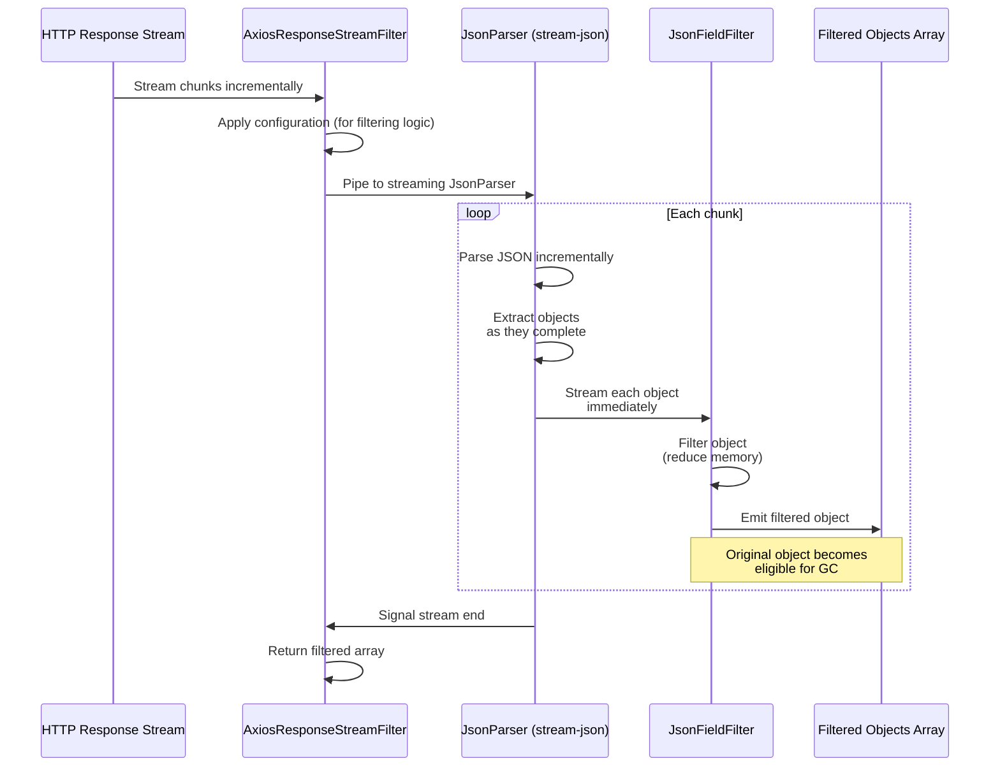

# Streaming Infrastructure

This directory contains the streaming infrastructure for memory-efficient processing of large JSON datasets from API responses. The implementation prevents loading full datasets into memory by processing JSON streams in real-time.

## Architecture Overview

The streaming pipeline consists of three main components:

1. **JsonParser** - Parses JSON streams and extracts objects
2. **JsonFieldFilter** - Filters fields from parsed JSON objects
3. **AxiosResponseStreamFilter** - Orchestrates the streaming pipeline for API responses



## Memory Optimization Achieved

**True streaming now provides genuine memory efficiency:**

- **Incremental parsing**: Objects parsed as JSON chunks arrive, not after complete document
- **Immediate filtering**: Each object filtered right away, reducing memory footprint before storage
- **Progressive GC**: Original unfiltered objects garbage collected as filtered versions are created
- **Constant memory**: Memory usage proportional to object size, not dataset size

For 100K records × 10KB each, memory usage is now ~10KB per object instead of ~1GB for the full dataset.

### JsonParser

A Node.js Transform stream that accumulates JSON chunks and parses complete objects. Key features:

- Handles streaming JSON data without loading full response into memory
- Extracts objects from JSON arrays or single objects
- Emits parsed JavaScript objects for downstream processing

**Parsing Timeline:**
1. Receives Buffer chunks from HTTP response stream
2. Accumulates chunks into complete JSON strings
3. Parses JSON and extracts individual objects
4. Emits objects to next stream in pipeline

### JsonFieldFilter

A Node.js Transform stream that filters fields from JSON objects during streaming. Key features:

- Removes unwanted fields from objects in-flight
- Reduces memory footprint by filtering before storage
- Configurable field selection via `fieldsToKeep` parameter
- **Advanced filtering** via optional `customFilterCase` callback for complex logic

#### Basic Field Filtering

```typescript
const filter = new JsonFieldFilter(['id', 'name', 'email']);
```

#### Advanced Custom Filtering

For complex filtering requirements beyond simple field selection, use the `customFilterCase` callback:

```typescript
const customFilter = (source: any, target: any) => {
  // Access both original (source) and filtered (target) objects
  // Modify target based on source data - person data in this example.
  
  // Example: Filter array elements by criteria
  if (source.personBasic?.names && Array.isArray(source.personBasic.names)) {
    const sapName = source.personBasic.names.find((name: any) => name.source === 'SAP');
    if (sapName) {
      target.personBasic = target.personBasic || {};
      target.personBasic.primaryName = sapName;
      delete target.personBasic.names; // Replace array with single object
    }
  }
};

const filter = new JsonFieldFilter(['personBasic.names'], customFilter);
```

**Key Benefits of `customFilterCase`:**
- Access to both original unfiltered data and filtered results
- Can perform complex transformations (arrays to objects, conditional filtering, etc.)
- Executed after standard field filtering for maximum flexibility
- Maintains streaming efficiency while enabling sophisticated logic

### AxiosResponseStreamFilter

Implements the `ResponseProcessor` interface to handle axios responses with streaming. Key features:

- Configurable via `AxiosResponseStreamFilterConfig`
- Supports both 'json' and 'stream' response types
- Orchestrates JsonParser and JsonFieldFilter in pipeline
- Returns filtered data as array of objects

## Memory Optimization

This streaming approach enables processing of large datasets (100K records × 10KB each) without loading the full response into memory:

- **Traditional approach:** Load entire JSON response (~1GB) into memory
- **Streaming approach:** Process objects one-by-one, maintaining minimal memory footprint

## Usage Example

```typescript
import { AxiosResponseStreamFilter } from './AxiosResponseStreamFilter';

// Configure filter to keep only essential fields
const filter = new AxiosResponseStreamFilter({
  fieldsToKeep: ['id', 'name', 'email']
});

// Process streaming response
const filteredData = await filter.processResponse(axiosResponse);
```

## Configuration

The `AxiosResponseStreamFilterConfig` interface supports:

- `fieldsToKeep`: Array of field names to retain in filtered objects
- Additional configuration options can be added as needed

## Dependencies

- Node.js streams (built-in)
- Axios for HTTP responses
- Stream-json library for advanced JSON parsing (if needed)

## Testing

The streaming components are thoroughly tested with:

- Unit tests for each component
- Integration tests for the full pipeline
- Mock streams for testing without real HTTP responses
- Memory usage validation to ensure efficiency